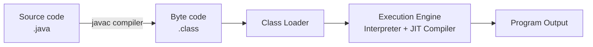
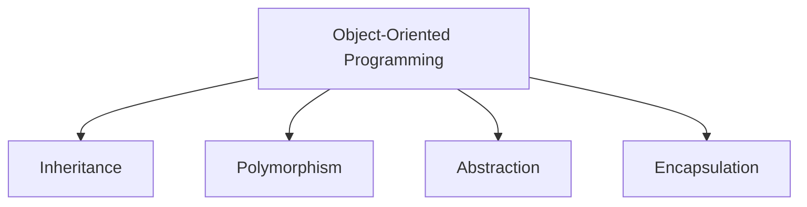
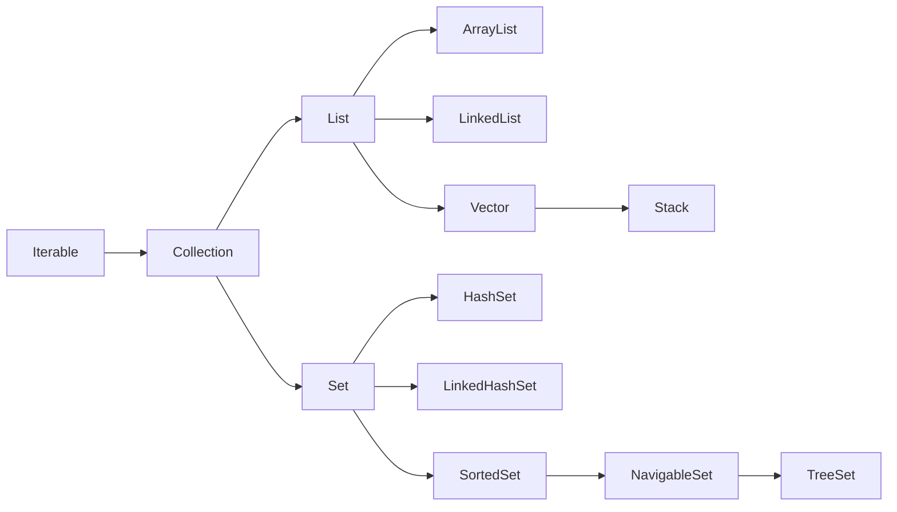
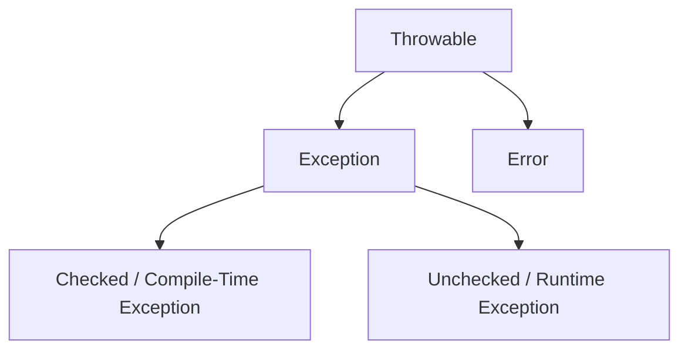
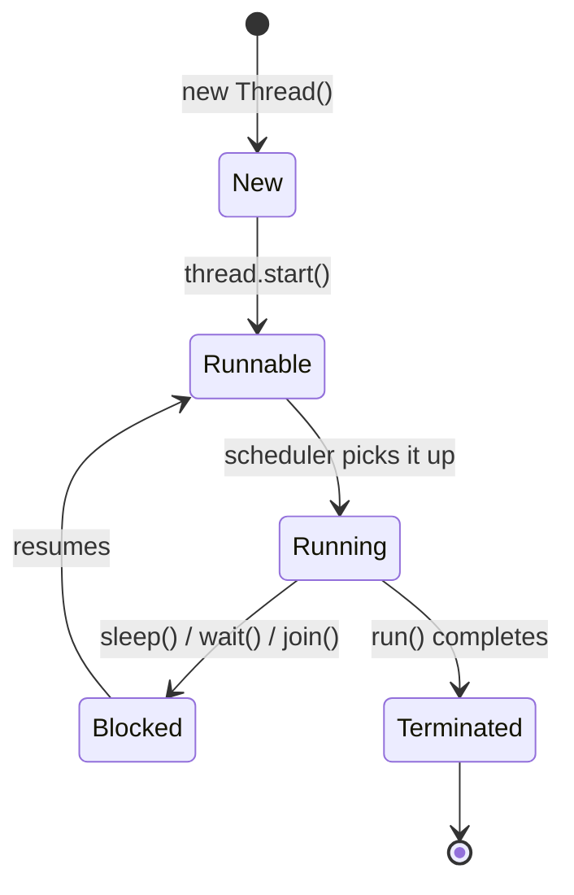

# Chapter 1: Core Java

## 1.1 Introduction to Java

Java is a high-level programming language used to build everything from small applications to large-scale,
enterprise-level systems — web-based or otherwise.

### 1.1.1 Features of Java

1. **Object-Oriented Programming Language** — Java supports OOP concepts, letting us model physical or virtual objects
   in code.
2. **Platform Independent** — A Java program can run on any platform. Java's slogan is **WORA** ("Write Once, Run
   Anywhere"). Programs are compiled into byte code, which can run on any platform, because the JVM itself is
   platform-independent.
3. **High Performance** — A technology that combines robustness, security, platform independence, and dynamism is
   generally considered high-performance, and Java checks all these boxes.
4. **Multithreaded** — Java supports multithreading; it's possible to create and run user threads concurrently.
5. **Simple** — Java eliminates many of the more confusing and error-prone concepts found in other languages, such as
   pointers and multiple inheritance.
6. **Portable** — Java applications are compiled once and can run on any operating system.

### 1.1.2 JDK, JRE, and JVM

- **JDK (Java Development Kit)** — a combination of a compiler and the JRE.
- **JRE (Java Runtime Environment)** — contains the JVM; it's a specification that provides the runtime environment in
  which Java byte code is executed.
- **JVM (Java Virtual Machine)** — called a "virtual" machine because it doesn't physically exist. It converts a
  `.class` file into binary or machine code specific to the host machine.

**JDK architecture:**

```
JDK = Compiler + JRE (which includes the JVM)
```

**Compilation and execution flow:**

1. We write Java code, producing a `.java` file.
2. The `javac` compiler (part of the JDK) compiles the code, converting human-readable source into byte code (a `.class`
   file).
3. We run the compiled byte code using the `java` launcher tool, which invokes the JVM to load and execute the `.class`
   file.
4. The **class loader** (a subsystem inside the JVM) loads the `.class` file into memory, verifies the byte code, and
   prepares and initializes the classes.
5. The byte code is verified and executed:
    - The **Execution Engine** inside the JVM executes the byte code.
    - The **Interpreter** executes instructions line by line.
    - The **JIT (Just-In-Time) compiler** converts "hot" (frequently executed) code into native machine code for better
      performance.
6. Finally, the `main` method runs.



---

## 1.2 Basics of Java

### 1.2.1 Data Types

A data type:

- Specifies the type of data being stored in a variable.
- Specifies the memory required to store it.
- Specifies the range of values allowed.

**To store numbers (integers):**

| Type    | Size    | Range       |
|---------|---------|-------------|
| `byte`  | 1 byte  | -128 to 127 |
| `short` | 2 bytes | —           |
| `int`   | 4 bytes | —           |
| `long`  | 8 bytes | —           |

**To store decimal values:**

| Type     | Size    |
|----------|---------|
| `float`  | 4 bytes |
| `double` | 8 bytes |

**To store character data:**

| Type   | Size    |
|--------|---------|
| `char` | 2 bytes |

**To store boolean values:**

| Type      | Size                       |
|-----------|----------------------------|
| `boolean` | 1 byte (`true` or `false`) |

### 1.2.2 Type Casting

Type casting is the process of assigning a value of one data type to a variable of another data type.

**1. Implicit type casting** — occurs when we assign a smaller data type's value to a larger data type. No data loss
occurs.

**2. Explicit type casting** — occurs when we assign a larger data type's value to a smaller one. There's a chance of
data loss, and it must be done explicitly.

### 1.2.3 Wrapper Classes

- Wrapper classes are the object representation of primitive data types — they "wrap" a primitive value inside an
  object.
- Wrapper classes are **immutable**: once created, their value cannot be changed — the same as the `String` class.

**Why do we need wrapper classes?**

- Collections cannot store primitives directly.
- They're needed to work with objects in framework APIs.
- They provide utility methods — parsing, converting, comparing, and more.

**Wrapper class for each primitive type:**

| Primitive Type | Wrapper Class |
|----------------|---------------|
| `byte`         | `Byte`        |
| `short`        | `Short`       |
| `int`          | `Integer`     |
| `long`         | `Long`        |
| `float`        | `Float`       |
| `double`       | `Double`      |
| `char`         | `Character`   |
| `boolean`      | `Boolean`     |

**Utility methods on wrapper classes:**

```
int a = Integer.parseInt("123");            // Converts a String to an int
double d = Double.parseDouble("12.34");     // Converts a String to a double
boolean b = Boolean.parseBoolean("true");   // Converts a String to a boolean
```

**Wrapper classes vs. primitives:**

| Feature                    | Primitive                    | Wrapper Class                   |
|----------------------------|------------------------------|---------------------------------|
| Stored as                  | Value                        | Object                          |
| Default value              | `0` (or `false` for boolean) | `null`                          |
| Can be used in collections | No                           | Yes                             |
| Methods available          | No                           | Yes (e.g., `parse`, `compare`)  |
| Performance                | Faster                       | Slower (due to object overhead) |

---

## 1.3 Control Statements

Control statements help decide the flow of execution of a program — which part of the code to execute, skip, or repeat.

**Types of control statements:**

1. **Conditional statements** — decide which part of the code to execute and which to skip, based on a boolean condition
   or value: `if...else` (condition-based) and `switch` (value-based).
2. **Looping / repeating / iterative statements** — repeat a block of statements: `for` (when the number of iterations
   is known in advance), `while` (when it isn't known in advance), `do...while` (when it isn't known in advance, and the
   code must run at least once), and `for-each` (for arrays and collections).
3. **Transfer statements** — transfer control of execution: `return` (can return a value), `break`, and `continue`.

### 1.3.1 The `if` Statement

- **What is it?** A control statement — a keyword — used for decision-making.
- **Why use it?** To decide which part of the code to execute. If the condition is true, the `if` block runs; if false,
  the rest of the code runs instead.
- `if` can appear on its own, without an `else`.

```
if(condition){
        // executed if the condition is true
}
```

The **condition** can be:

- A direct boolean value.
- An expression that evaluates to a boolean.
- A method call that returns a boolean.

### 1.3.2 The `else` Keyword

- `else` always comes paired with an `if` — it cannot appear on its own.
- The `else` block executes when the `if` condition is false.

```
if(condition){
        // if the condition is true
        }else{
        // if the condition is false
        }
```

- You cannot write independent statements between an `if` and its `else` — doing so causes a compile-time error.
- Every `else` must have a matching `if`.

### 1.3.3 `if` vs. `switch`

- Use **`if`** when performing comparison operations (`>`, `>=`, `<`, `<=`, `!=`, `==`, `&`, `&&`, `|`, `||`, `^`) that
  evaluate to a boolean.
- Use **`switch`** when performing an equality check against a single value.

### 1.3.4 The `switch` Statement

- A keyword used to compare a given value against a set of cases.
- We compare a single value across multiple case labels.

```
switch(value){
        case label:
statements;
        break;
default:
statements;
}
```

- `case`, `default`, and `break` are all optional.
- The value and each case label's data type must match.
- If `default` is absent and the value doesn't match any case, nothing inside the `switch` executes.
- If `break` is omitted, execution "falls through": all statements from the matching case onward execute until the next
  `break` is reached.

### 1.3.5 Looping Statements

**`for`** — used to repeat a task a known number of times.

```
for(initialization;condition;increment/decrement){
        // repeated until the condition is false
        }
```

- **Initialization** — optional; runs only once.
- **Condition** — optional (defaults to `true`, causing an infinite loop if omitted); can be a boolean literal, an
  expression, or a method call returning a boolean.
- **Increment/decrement** — optional; used to update the loop's counter.

**`while`** — used when the number of iterations isn't known in advance.

```
while(condition){
        // repeated while the condition is true
        }
```

The condition follows the same rules as in a `for` loop: optional, defaults to `true`, and can be a literal, expression,
or method call.

### 1.3.6 Transfer Statements

- **`break`** — used inside a `switch` or a loop; using it elsewhere causes a compile-time error. It transfers control
  out of the loop or `switch`.
- **`continue`** — used only inside loops; using it elsewhere causes a compile-time error. It skips the rest of the
  current iteration and moves on to the next one.
- **`return`** — used inside a method. Once it executes, the rest of the method's code does not run.

---

## 1.4 Class Components

### 1.4.1 Class

- A class is a named group of properties and functions.
- It's a blueprint, template, or layout for the objects that will be created from it.
- `class` is a keyword used to define a class (the term comes from "classification").
- We need a class in order to create objects — and we can create any number of objects from a single class.

### 1.4.2 Object

- An object is an instance of a class.
- **Instance** — any allocated block of memory.
- An object is memory allocated to hold data for a given class type.
- **Why do we need objects?** To store data.

```
ClassName referenceVariableName = new ClassName();
// e.g.
A a = new A();
```

### 1.4.3 Singleton Class

A singleton class allows only one instance to be created.

- We implement it by making the class's constructor private, and exposing a static method that returns the instance.
- Inside that method, we check whether an instance already exists — if so, we return the existing one; otherwise, we
  create it.
- Every reference to the class ends up pointing at the same object.

```
public class SingleTon {

    // Private constructor so no one else can create a new instance
    private SingleTon() {
    }

    // Uninitialized private instance
    private static SingleTon instance;

    // Returns the existing instance, or creates one if it doesn't exist yet
    public static SingleTon getInstance() {
        if (instance == null) {
            instance = new SingleTon();
        }
        return instance;
    }
}
```

### 1.4.4 Variables

A variable is a name used to store a value.

**Based on the value stored:**

1. **Primitive variable** — used to hold a primitive (direct) value. E.g., `int i = 1;`
2. **Reference variable** — holds a reference (address) to a memory location. E.g., `Product product = new Product();`

**Based on memory location and position in the program:**

1. **Local variable**
    - Declared inside a method, block, constructor, or as a method parameter — usable only within that scope.
    - Used to hold values that are local and temporary to a method, block, or constructor.
    - Can be either primitive or reference.
    - Stored in **stack** memory.
    - Gets memory allocated only when its enclosing block, method, or constructor is invoked.

2. **Instance variable**
    - Declared at the class level, outside all methods, constructors, and blocks.
    - Used to hold object-specific values.
    - Accessed via a reference name or reference variable.
    - Can be either primitive or reference.
    - Stored in **heap** memory.
    - Gets memory allocated every time a new object is created.

3. **Static variable**
    - Declared at the class level, outside all methods, constructors, and blocks, with the `static` keyword.
    - Used to store a value that's common across all objects of the class.
    - Accessed via the class name.
    - Can be either primitive or reference.
    - Stored in the class's dedicated memory area.
    - Used to share data across all instances of a class.
    - Gets memory allocated only once, when the class is loaded.

### 1.4.5 Methods

- A method is a group of statements enclosed in braces.
- It has a name.
- It can accept input parameters.
- It can return output via a `return` statement.
- Methods let us achieve code reusability.
- We can restrict access to a method using access specifiers.

```
accessSpecifier returnType

methodName(methodParameters) {
    // statements to execute
    // optional return statement
}

// e.g.
public static void main(String[] args) {
    // statements to execute
}
```

**Types of methods:**

1. **Instance methods** — object-specific; accessed via a reference to the object, since they belong to that particular
   object.
2. **Static methods** — common to all instances; accessed via the class name.

### 1.4.6 Constructors

- A constructor is a method with the same name as its class.
- Constructors do not have a return type or an access modifier.
- Constructors are used to construct — that is, initialize — an object.
- **Initialization** means providing initial values to instance variables.

```
class Student {
    private int rollNo;
    private String studentName;

    Student(int rollNo, String studentName) {
        this.rollNo = rollNo;
        this.studentName = studentName;
    }
}

Student student = new Student(1, "Vaishnav");
```

**Types of constructors:**

1. **Default constructor** — if we don't provide any constructor and directly create an object, the Java compiler
   supplies a default one automatically.
2. **Zero-parameter (no-argument) constructor** — a constructor we define ourselves, that takes no input values.

   ```
   class Student {
       Student() {
           // statements
       }
   }

   Student student = new Student();
   ```

3. **Parameterized constructor** — a constructor we define that accepts one or more input values.

   ```
   class Student {
       private int rollNo;
       private String studentName;

       Student(int rollNo, String studentName) {
           this.rollNo = rollNo;
           this.studentName = studentName;
       }
   }

   Student student = new Student(1, "Vaishnav");
   ```

### 1.4.7 Blocks

- Blocks are groups of statements enclosed in braces, with no modifiers or access specifiers.
- They're used for non-initialization activities, such as maintaining a counter.

```
{
        // group of statements
        }
```

**Types of blocks:**

1. **Instance block** — defined at the class level, without any modifiers. Used for non-initialization activities such
   as maintaining a counter. It runs every time an object is created, before the constructor.
2. **Static block** — defined at the class level, with the `static` keyword. Used for one-time setup activities. It runs
   at class-loading time.

### 1.4.8 Nested Classes

A nested class is a class defined inside another class.

**Types:**

1. **Local inner class** — defined inside a method; usable only within that method. It cannot contain any static
   members.
2. **Inner class (non-static inner class)** — defined inside a class, without the `static` keyword. It also cannot
   contain any static members.
3. **Static nested class** — defined inside a class, with the `static` keyword. It can contain both static and
   non-static members.

### 1.4.9 The `this` Keyword

- `this` is a reference variable that points to the current class's object.
- Since it references the current object, we can use it to access that object's instance variables and methods.

### 1.4.10 Access Specifiers

Access specifiers determine the visibility of a class's members. We use them to grant or restrict access to class
components.

**Types of access specifiers:**

1. **`public`** — accessible from anywhere in the application.
2. **`private`** — accessible only within the same class.
3. **default** (no modifier) — accessible only within the same package.
4. **`protected`** — accessible within the same package, or from a subclass in a different package.

> **Note:** A top-level (outer) class cannot be `private`, `protected`, or `static`.

### 1.4.11 Static vs. Non-Static

We cannot access any non-static member from a static context without first creating an instance of the class.

---

## 1.5 Object-Oriented Programming (OOP)

The four pillars of OOP:

1. Inheritance
2. Polymorphism
3. Abstraction
4. Encapsulation



### 1.5.1 Inheritance

- Inheritance means acquiring the non-private properties and methods of a parent class into a child class.
- We achieve inheritance using the `extends` keyword.
- Inheritance models an **IS-A** relationship.
- We use it to reuse code and avoid duplication.

**How to implement it:**

```
class Parent {
    // common data
    // common methods
}

class Child extends Parent {
    // Child inherits Parent's non-private data and methods
}
```

- **Private** members of the parent are **not** accessible to the child.
- **Public** members of the parent **are** accessible to the child.
- **Protected** members of the parent are accessible to the child regardless of whether they're in the same or a
  different package — because `protected` exists specifically for subclasses.
- **Default** (package-private) members of the parent are accessible to the child only if both classes are in the same
  package.
- **Static** members of the parent are accessible to the child, but they always belong to the parent class's own memory
  area, not the child's.

> **Note:**
> - A child class can access the parent class's non-private members.
> - The parent class **cannot** access the child class's members.
> - Every child class constructor implicitly calls its parent class constructor first.

**Order of execution when an object is created:**

1. Static block of the parent class
2. Static block of the child class
3. Instance block of the parent class
4. Constructor of the parent class
5. Instance block of the child class
6. Constructor of the child class

**Types of inheritance:**

1. **Single-level** — acquiring data and methods directly from a parent class into a child class.
2. **Multilevel** — acquiring data and methods across multiple generations (grandparent → parent → child).

   ```
   class A { }
   class B extends A { }  // B can access A's data
   class C extends B { }  // C can access B's data, and A's data too
   ```

3. **Multiple inheritance** — a child class inheriting from two parent classes. **This is not possible with classes in
   Java**, due to the diamond problem.

   > **Diamond problem:** If a class tries to inherit from two parent classes that both define the same variable, the
   compiler can't determine which one to use. This ambiguity is called the diamond problem.
   >
   > **Note:** Two child classes can each extend the same parent class, but one child class cannot extend two parent
   classes, due to the diamond problem.

**The `super` Keyword**

- `super` is a reference variable that points to the parent (super) class's object.
- It's used to access the parent class's data and methods.

### 1.5.2 Polymorphism

- Polymorphism is the ability of an object to change its behavior. ("Poly" = many, "morph" =
  forms/behaviors/implementations.)
- It refers to having multiple implementations of a method.
- Behavior can change either at compile time or at runtime.

**1. Compile-Time Polymorphism** (a.k.a. static polymorphism, early binding, static binding)

- The method call is resolved at compile time.
- Achieved via **method overloading**.

**Overloading:**

- We define multiple methods with the same name, but different signatures (a different number of parameters, or
  different parameter types).
- The return type is **not** considered when determining overloading, whether it's the same or different.
- Method calls are resolved at compile time.
- Static, final, instance, public, private, protected, and default methods can all be overloaded.
- The `main` method can also be overloaded, as long as the signature differs.

**2. Runtime Polymorphism** (a.k.a. dynamic polymorphism, dynamic binding, late binding)

- The method call is resolved at runtime.
- Achieved via **method overriding**.

**Overriding:**

- We define a method in the child class with the same name, same signature, and same return type as a method in the
  parent class.
- The return type **is** considered for overriding — it must match.
- The method call is resolved at runtime.
- Overriding requires an IS-A (parent-child) relationship between the classes.
- Private, static, and final methods **cannot** be overridden — because they aren't accessible for overriding in a child
  class in the relevant sense.

> **Note:** With overriding, an access specifier can only be *widened* (made less restrictive) in the child class —
> e.g., `default` → `protected` → `public`.

**Concrete vs. Abstract:**

- **Concrete method** — a method with a full body (a complete method).
- **Abstract method** — a method with no body (an incomplete method), declared with the `abstract` keyword.
- **Concrete class** — a class made up entirely of concrete methods.
- **Abstract class** — a class declared with the `abstract` keyword, which may contain abstract methods (as well as
  concrete ones). It cannot be instantiated, since it's considered incomplete.
    - If a **concrete** child class extends an abstract parent class, it must implement all of the inherited abstract
      methods.
    - If an **abstract** child class extends an abstract parent class, it is **not** required to implement the inherited
      abstract methods.

### 1.5.3 Abstraction

Abstraction is the process of hiding implementation details (the method body) while exposing only the functionality (the
method declaration).

**How to achieve abstraction:**

1. Create an abstract parent class.
2. Create a concrete child class that extends it.
3. Provide an implementation for the inherited abstract method (s).
4. Create an object of the child class.
5. When you call the method, the child class's overridden implementation runs.

**Calling an abstract class's constructor:**

- When a child class object is created, its constructor call first delegates to the parent (abstract) class's
  constructor.
- Every child class constructor first calls its parent class's constructor.
- Trying to instantiate an abstract class or an interface directly results in a compile-time error (attempting so at
  runtime via reflection throws `InstantiationException`).

### 1.5.4 Encapsulation

- Encapsulation means binding data and the methods that act on it together, as a single unit.
- We make data members `private`, and expose them only through public getter and setter methods.
- Encapsulation gives us better control over data access, and better data security.

---

## 1.6 Interfaces

- An interface is a fully unimplemented, or incomplete, "class."
- Created using the `interface` keyword.
- By default, methods inside an interface are `public abstract`.
- By default, variables inside an interface are `public static final`.
- By default, nested classes inside an interface are `public static`.
- Since it's incomplete, you cannot create an object of an interface directly.
- A class **extends** another class. A class **implements** an interface. An interface **extends** another interface.
- When a **concrete** class implements an interface, it must provide implementations for all of its methods.
- When an **abstract** class implements an interface, it is not required to implement those methods.

**Why aren't constructors allowed inside an interface?**

- Modifiers can't be applied to constructors.
- By default, methods inside an interface are `public abstract`, and this applies to every method in the interface — but
  a constructor can't have `public abstract` as a modifier.

**What can be part of an interface?**

- Abstract methods
- Static methods
- Default methods
- Nested (static) classes
- Static variables

**What can't be part of an interface?**

- Concrete instance methods
- `final` methods (since they can't be overridden)
- Constructors (explained above)
- Instance blocks (they only run when an object is created, and interfaces can't be instantiated)
- Static blocks (common to all implementers, and modifiers can't be applied)
- Instance variables (again, since interfaces can't be instantiated)
- Private methods (inaccessible outside the class, so they could never be overridden — making them pointless in this
  context)

### 1.6.1 Marker Interfaces

An interface with no members (no methods or variables) is called a **marker interface** (also known as a tagged or
ability interface).

- When a class implements a marker interface, it's granted certain capabilities associated with that interface.
- It's essentially used for marking/tagging purposes.

> **Note:** User-defined empty interfaces aren't automatically considered marker interfaces — only *predefined* empty
> interfaces are, such as `Serializable`, `Cloneable`, and `RandomAccess`.

### 1.6.2 Functional Interfaces

- A functional interface has exactly one abstract method.
- Also known as a **Single Abstract Method (SAM)** interface.
- Instances of functional interfaces can be created using lambda expressions, method references, or constructor
  references.
- A functional interface may contain any number of static or default methods.
- The main purpose of functional interfaces is to support lambda expressions.

---

## 1.7 Arrays

- An array is a collection of multiple elements of the same data type, stored in contiguous memory.
- Arrays let us hold multiple values of the same type together.

**Creating an array:**

```
dataType[] arrayName = new dataType[size];

// e.g.
int[] array = new int[10];       // Declaration + initialization
int[] array2 = {1, 2, 3};
```

- An array is internally considered an object; the `[]` denotes an array-type variable.
- We don't specify a size on the left-hand side of the declaration.
- When an array is created, an object is created for it, and a `length` field is initialized to the array's size.

**Accessing array elements:**

- Elements are accessed via an index.
- The index ranges from `0` to `array.length - 1`.

**Why do array indices start at zero?**

- An array variable points to the base address where all elements are stored sequentially.
- The first element is at `baseAddress + (size of data type in bytes × 0)`.
- The second element is at `baseAddress + (size of data type in bytes × 1)`, and so on.

**Drawbacks of arrays:**

- Fixed in size.
- Can only store homogeneous data.
- No built-in method support.
- For operations like sorting, searching, or deleting, you must write the logic yourself.

**The `Arrays` class:**

- Part of the `java.util` package.
- Provides utility methods for working with arrays — sorting, filling, comparing, parallel sorting, converting to a
  string, copying, and more.
- Works only with arrays, not with `ArrayList`.

---

## 1.8 String, StringBuilder, and StringBuffer

### 1.8.1 String

- `String` is a predefined class in the `java.lang` package, used to represent a sequence of characters.
- Internally, the `String` class maintains an array of characters.
- `String` objects are **immutable**: whenever you "modify" a string, a new object is created, and the old object is
  left without any reference. The garbage collector eventually cleans up such unreferenced objects.
- `String` objects are thread-safe, precisely because of their immutability — once created, a string can never be
  modified.

**Ways to construct a `String` object:**

```
// 1. Using the `new` keyword
String str = new String("Some Value");

// 2. Using a string literal
String str = "Some value";
```

**Why do we need a `String` class, when a char array is already available?**

- Storing and manipulating a group of characters with a raw `char[]` is difficult and time-consuming.
- There's no built-in method support.
- Arrays are fixed in size.

**Literal vs. `new` keyword — object creation:**

**1. Using `new`:**

- The `String` object is created in **heap** memory.
- Object creation happens directly, without checking for existing identical objects.
- The heap allows duplicate objects.

**2. Using a literal:**

- The `String` object is created inside the **String Constant Pool (SCP)**.
- Before creating a new object, the JVM checks whether an identical string already exists in the SCP.
- If it does, the existing object's reference is reused.
- If not, the JVM creates a new object.
- The SCP does not allow duplicate objects.

**Immutability:**

- "Immutable" means the object's state cannot be changed after creation.
- Immutable classes are typically `private final`.
- We make the class itself effectively closed off from modification, and its fields `final`.
- We don't provide setters.

### 1.8.2 StringBuffer and StringBuilder

**Why do we need them?** Since `String` is immutable, it becomes inefficient when doing repeated modifications — for
example, inside a loop, or repeated concatenations. `StringBuffer` and `StringBuilder` exist to solve exactly this
problem.

- Both classes are **mutable**.
- We can modify an existing object without creating a new one each time.
- They're more memory-efficient for frequent concatenation or string manipulation.

**Common methods in both classes:**

| Method                                    | Description                                                         |
|-------------------------------------------|---------------------------------------------------------------------|
| `append(String str)`                      | Adds a string to the end                                            |
| `insert(int offset, String str)`          | Inserts a string at the specified index                             |
| `delete(int start, int end)`              | Deletes characters from `start` to `end - 1`                        |
| `reverse()`                               | Reverses the sequence                                               |
| `toString()`                              | Converts to a normal `String`                                       |
| `replace(int start, int end, String str)` | Replaces characters from `start` to `end - 1` with the given string |
| `capacity()`                              | Returns the current capacity                                        |
| `ensureCapacity(int minCapacity)`         | Ensures the capacity is at least `minCapacity`                      |

**`StringBuilder`:**

- Mutable.
- Its methods are **not** synchronized.
- Faster, since there's no synchronization overhead.
- Best used in single-threaded environments (which covers most typical code).

```
public class Main {
    public static void main(String[] args) {
        StringBuilder sb = new StringBuilder("Hello");
        sb.append(" World");
        sb.append("!");
        System.out.println(sb); // Hello World!
    }
}
```

**`StringBuffer`:**

- Also mutable.
- Its methods **are** synchronized.
- Slightly slower than `StringBuilder`, due to the synchronization overhead.
- Best used in multithreaded environments, where multiple threads might modify the same string object.

```
public class Main {
    public static void main(String[] args) {
        StringBuffer sb = new StringBuffer("Hello");
        sb.append(" World");
        sb.append("!");
        System.out.println(sb); // Hello World!
    }
}
```

---

## 1.9 The Collection Framework



*(`[I]` denotes an interface, `[C]` denotes a class.)*

### 1.9.1 List `[I]`

**Common characteristics across all `List` implementations:**

- Heterogeneous objects are allowed.
- Duplicate objects are allowed.
- `null` insertion is possible.
- Insertion order is preserved.
- Sorting order is not preserved.

**a. `ArrayList` `[C]`**

- Internally uses a growable array data structure.
- Creates a new, larger array internally once the current one is full.
- New capacity = old capacity × 1.5 + 1.
- Its methods are **non-synchronized**.
- Supported cursors: `Iterator`, `ListIterator`.

**b. `LinkedList` `[C]`**

- Internally uses a doubly linked list.
- There's no fixed "capacity" concept, since nodes are added as needed.
- Its methods are **non-synchronized**.
- Supported cursors: `Iterator`, `ListIterator`.

**c. `Vector` `[C]`**

- Internally uses a growable array.
- Creates a new array once the current one is full.
- New capacity = old capacity × 2.
- Its methods are **synchronized** (thread-safe).
- A legacy class *(legacy classes are those introduced in Java 1.0)*.
- Supported cursors: `Iterator`, `ListIterator`, `Enumeration`.

**d. `Stack` `[C]`**

- Extends `Vector`.
- Internally uses a stack data structure.
- Its methods are **not synchronized**.
- Works on the **Last-In, First-Out (LIFO)** principle.

### 1.9.2 Set `[I]`

**Common characteristics across all `Set` implementations:**

- Only unique elements are allowed.
- Methods are non-synchronized.
- Only the `Iterator` cursor is supported.

**a. `HashSet` `[C]`**

- Insertion order is not preserved.
- Sorting order is not preserved.
- Can store homogeneous or heterogeneous data.
- A single `null` insertion is allowed.
- Internally backed by a `HashMap`.
- Works on the hashing principle — converting a larger value into a smaller, fixed-size representation.

**b. `LinkedHashSet` `[C]`**

- Insertion order **is** preserved.
- Sorting order is not preserved.
- Can store homogeneous or heterogeneous data.
- A single `null` insertion is allowed.
- Internally backed by a `LinkedHashMap`.

**c. `TreeSet` `[C]`** *(`SortedSet [I]` → `NavigableSet [I]` → `TreeSet [C]`)*

- Insertion order is not preserved.
- Sorting order **is** preserved.
- `null` insertion is not allowed.
- Internally uses a Red-Black Tree.
- Only homogeneous elements are allowed.
- Stores elements that implement `Comparable`, or that are provided with a `Comparator`.

### 1.9.3 Map `[I]`

- `Map` belongs to a completely separate hierarchy from `Collection`.
- It's an interface in the `java.util` package.
- A `Map` is an object that maps keys to values.
- Use it whenever you need to associate multiple values in key-value pairs.
- A single key-value pair is called an **entry**.
- Keys are always unique; values can be duplicated freely.

**Map hierarchy:**

```
Map [I] -> HashMap [C]
        -> LinkedHashMap [C]
        -> SortedMap [I] -> NavigableMap [I] -> TreeMap [C]
```

**a. `HashMap` `[C]`**

- Insertion order of keys and values is not preserved.
- Sorting order is not preserved.
- Keys and values can be homogeneous or heterogeneous.
- Exactly one `null` key is allowed; values can have any number of `null`s.
- Internally uses a hash table structure.

**b. `LinkedHashMap` `[C]`**

- Insertion order of **keys** is preserved.
- Sorting order is not preserved.
- Keys and values can be homogeneous or heterogeneous.
- Exactly one `null` key is allowed; values can have any number of `null`s.
- Internally uses a hash table plus a linked list.

**c. `TreeMap` `[C]`** *(`SortedMap [I]` → `NavigableMap [I]` → `TreeMap [C]`)*

- Sorting order of keys is preserved.
- Insertion order of keys is not preserved.
- Keys must be homogeneous; there's no restriction on values.
- `null` keys are not allowed; there's no restriction on `null` values.
- Internally uses a Red-Black Tree.

### 1.9.4 Arrays vs. Collections

| Arrays                         | Collections                       |
|--------------------------------|-----------------------------------|
| Fixed in size                  | Growable                          |
| Homogeneous data only          | Homogeneous or heterogeneous data |
| No method support              | Rich, predefined method support   |
| Can hold primitives or objects | Can hold only objects             |

### 1.9.5 The `Collections` Class

- A utility class in the `java.util` package.
- Consists entirely of `static` methods that operate on, or return, collections like lists, sets, and maps.
- Distinct from the `Collection` interface.
- Provides static utility methods for collection-related operations — sorting, searching, synchronizing, shuffling, and
  more.

**Commonly used methods in the `Collections` class:**

| Method                                                            | Description                                 |
|-------------------------------------------------------------------|---------------------------------------------|
| `sort(List<T> list)`                                              | Sorts the list into ascending order         |
| `sort(List<T> list, Comparator<T> c)`                             | Sorts with a custom comparator              |
| `reverse(List<?> list)`                                           | Reverses the order of the elements          |
| `shuffle(List<?> list)`                                           | Randomly permutes the elements              |
| `swap(List<?> list, int i, int j)`                                | Swaps the elements at the given positions   |
| `max(Collection<?> coll)`                                         | Returns the maximum element                 |
| `min(Collection<?> coll)`                                         | Returns the minimum element                 |
| `frequency(Collection<?> c, Object o)`                            | Counts how many times an object appears     |
| `binarySearch(List<? extends Comparable<? super T>> list, T key)` | Searches for a key using binary search      |
| `fill(List<? super T> list, T obj)`                               | Replaces all elements with the given object |
| `copy(List<? super T> dest, List<? extends T> src)`               | Copies all elements from `src` into `dest`  |
| `synchronizedList(List<T> list)`                                  | Returns a thread-safe wrapper for the list  |

**`Collection` vs. `Collections`:**

| `Collection`                                         | `Collections`                                     |
|------------------------------------------------------|---------------------------------------------------|
| An interface                                         | A utility class                                   |
| The root interface for `List`, `Set`, etc.           | Contains static methods for collection operations |
| e.g., `Collection<String> list = new ArrayList<>();` | e.g., `Collections.sort(list);`                   |

### 1.9.6 Cursors

Cursors let us traverse (iterate over) the elements of a collection — they're objects that let us visit each element
sequentially.

**1. `Enumeration`**

- The oldest cursor, used with legacy classes like `Vector` and `Hashtable`.

| Method              | Description                        |
|---------------------|------------------------------------|
| `hasMoreElements()` | Checks whether more elements exist |
| `nextElement()`     | Returns the next element           |

- A **read-only** cursor.
- Cannot remove elements while iterating.

**2. `Iterator`**

- A universal iterator that works with all collection types (legacy classes included).
- Traverses in a forward direction only.

| Method      | Description                                         |
|-------------|-----------------------------------------------------|
| `hasNext()` | Checks whether a next element exists                |
| `next()`    | Returns the next element                            |
| `remove()`  | Removes the current element (an optional operation) |

**3. `ListIterator`**

- An extended version of `Iterator`, for `List` implementations only.
- Supports bidirectional traversal (forward and backward).
- Allows adding, removing, or replacing elements while iterating.

| Method                         | Description                  |
|--------------------------------|------------------------------|
| `hasNext()` / `next()`         | Forward traversal            |
| `hasPrevious()` / `previous()` | Backward traversal           |
| `add(E e)`                     | Adds an element              |
| `remove()`                     | Removes the current element  |
| `set(E e)`                     | Replaces the current element |

**Fail-fast behavior:**

- `Iterator` and `ListIterator` throw a `ConcurrentModificationException` if the underlying collection is structurally
  modified while iterating, outside of the iterator's own methods.
- `Enumeration` is not fail-fast (it's safe with legacy classes, since their methods are already synchronized, but it
  lacks any modification methods).

**When to use which cursor:**

- **`Enumeration`** — legacy classes (rare in modern code).
- **`Iterator`** — general-purpose iteration over any collection.
- **`ListIterator`** — when working with a `List`, and you need bidirectional traversal, or the ability to add/set
  elements during iteration.

### 1.9.7 Comparable and Comparator

Two interfaces used to compare objects. Both are part of the Java Collections Framework, but they're used in different
scenarios and implemented differently.

**`Comparable` `[I]`**

- Used to define the *natural* sorting order of objects.
- Method to implement: `public int compareTo(T o);`
- `compareTo()` returns `0`, a negative number, or a positive number, indicating equality, "less than," or "greater
  than."
- We implement `Comparable` directly inside the class whose objects we want to sort — the class itself defines how two
  of its instances compare.

**Natural sorting order:**

- The default sorting order used when no custom sorting is specified.
- The order that "makes the most obvious sense" for a particular type.
- For custom classes, we define the natural sorting order ourselves, by implementing `compareTo()`.
- Example: `String`'s natural order is alphabetical; `Integer`'s is numerical, ascending. For a `Book` class, the
  natural order might be alphabetical by title, while a *custom* order might sort by author or price instead.

```
class Student implements Comparable<Student> {
    int id;
    String name;

    Student(int id, String name) {
        this.id = id;
        this.name = name;
    }

    public int compareTo(Student s) {
        return this.id - s.id; // sort by ID, ascending
    }
}

// Usage
List<Student> list = new ArrayList<>();
list.

add(new Student(2, "John"));
        list.

add(new Student(1, "Alice"));
        Collections.

sort(list); // uses compareTo()
```

**`Comparator` `[I]`**

- Used to define a *custom* sorting order, outside of the class being sorted.
- Method to implement: `public int compare(T o1, T o2);`
- Returns a negative number, `0`, or a positive number, indicating "less than," equal, or "greater than."

```
class Student {
    int id;
    String name;

    Student(int id, String name) {
        this.id = id;
        this.name = name;
    }
}

// Custom comparator to sort by name
class NameComparator implements Comparator<Student> {
    public int compare(Student s1, Student s2) {
        return s1.name.compareTo(s2.name);
    }
}

// Usage
List<Student> list = new ArrayList<>();
list.

add(new Student(2, "John"));
        list.

add(new Student(1, "Alice"));
        Collections.

sort(list, new NameComparator()); // uses compare()
```

- `Comparator` is a functional interface, so instead of creating a separate class, we can implement `compare()` directly
  with a lambda expression:

```
Collections.sort(list, (s1, s2) ->s1.name.

compareTo(s2.name));
```

> **Note:** We still need `Collections.sort()` to actually perform the sort — `Comparable` and `Comparator` only define
> the sorting *logic*.

---

## 1.10 Streams API

- Introduced in Java 8, to process collections of objects in a functional style.
- Lets you perform operations — filter, map, sort, and more — on a collection in a declarative and concise way.

```
// Before Streams
List<String> names = Arrays.asList("John", "Smith", "Sara");
List<String> upper = new ArrayList<>();
for(
String name :names){
        upper.

add(name.toUpperCase());
        }

// With Streams
List<String> upper = names.stream()
        .map(String::toUpperCase)
        .collect(Collectors.toList());
```

**Advantages:** cleaner, boilerplate-free code; easy support for parallel processing; and support for functional
programming constructs like `map`, `filter`, and `reduce`.

- A stream is a sequence of elements supporting aggregate operations.
- It does **not** store data — it processes data from a source (a collection, array, or I/O channel).

**Types of streams:**

| Type              | Description                                                               |
|-------------------|---------------------------------------------------------------------------|
| Sequential Stream | Processes data on a single thread, sequentially (the default)             |
| Parallel Stream   | Processes data across multiple threads, in parallel (`.parallelStream()`) |

**A stream pipeline consists of:**

1. A **source** (collection, array, etc.).
2. **Intermediate operations** (each returns a new stream).
3. A **terminal operation** (produces a result or a side effect).

```
List<Integer> nums = Arrays.asList(1, 2, 3, 4, 5);
nums.

stream()
    .

filter(n ->n %2==0)       // intermediate
        .

map(n ->n *n)               // intermediate
        .

forEach(System.out::println); // terminal
```

### 1.10.1 Intermediate Operations

These are lazily evaluated — they return a new stream, which is only actually processed once a terminal operation is
invoked.

| Method              | Description                                 |
|---------------------|---------------------------------------------|
| `filter(Predicate)` | Selects elements matching a condition       |
| `map(Function)`     | Transforms each element                     |
| `flatMap(Function)` | Flattens nested structures                  |
| `sorted()`          | Sorts elements (natural order)              |
| `distinct()`        | Removes duplicates                          |
| `limit(n)`          | Limits the stream to the first `n` elements |
| `skip(n)`           | Skips the first `n` elements                |

### 1.10.2 Terminal Operations

These produce the final result or side effect, and end the pipeline.

| Method                                | Description                                           |
|---------------------------------------|-------------------------------------------------------|
| `forEach(Consumer)`                   | Performs an action for each element                   |
| `collect(Collector)`                  | Converts the stream into a `List`, `Set`, `Map`, etc. |
| `reduce(BinaryOperator)`              | Combines elements into a single result                |
| `count()`                             | Counts the number of elements                         |
| `anyMatch` / `allMatch` / `noneMatch` | Checks conditions across the stream                   |
| `findFirst` / `findAny`               | Returns the first, or any, matching element           |

### 1.10.3 Collectors

A utility class providing methods to collect a stream's results into a desired structure.

```
List<String> list = names.stream().collect(Collectors.toList());
Set<String> set = names.stream().collect(Collectors.toSet());
Map<Integer, String> map = employees.stream()
        .collect(Collectors.toMap(Employee::getId, Employee::getName));
```

**Other useful collectors:**

- **`joining()`** — concatenates strings.
- **`groupingBy()`** — groups elements by a key.

  ```
  Map<String, List<String>> grouped = names.stream()
      .collect(Collectors.groupingBy(s -> s.substring(0, 1)));
  System.out.println(grouped); // groups names by their first letter
  ```

- **`partitioningBy()`** — partitions elements into two groups, based on a predicate. Always returns a
  `Map<Boolean, List<T>>`: `true` for elements matching the predicate, `false` for the rest. Unlike `groupingBy()`
  (which can create many groups), `partitioningBy()` always creates exactly two. You can also apply another collector to
  each partition (e.g., `counting()`).

  ```
  List<Integer> nums = Arrays.asList(10, 15, 20, 25, 30);
  Map<Boolean, List<Integer>> partitioned = nums.stream()
      .collect(Collectors.partitioningBy(n -> n % 2 == 0));
  System.out.println(partitioned);
  // {false=[15, 25], true=[10, 20, 30]}
  ```

### 1.10.4 `map` vs. `flatMap`

| `map`                                               | `flatMap`                                       |
|-----------------------------------------------------|-------------------------------------------------|
| Transforms each element                             | Flattens nested structures, and transforms them |
| Result is `Stream<Stream<T>>` if mapping to streams | Result is a flat `Stream<T>`                    |

```
List<List<String>> data = Arrays.asList(
        Arrays.asList("a", "b"),
        Arrays.asList("c", "d")
);
data.

stream()
    .

flatMap(list ->list.

stream())
        .

forEach(System.out::println);
// a, b, c, d
```

### 1.10.5 Parallel Streams

- For large data sets, parallel streams process elements across multiple threads.
- Use them cautiously, given the thread-safety concerns they introduce.
- Streams are single-use: once a terminal operation is called, the stream is consumed and cannot be reused.

**Streams vs. Collections:**

| Streams                        | Collections                          |
|--------------------------------|--------------------------------------|
| For processing data            | For storing data                     |
| Doesn't modify the data source | Stores data, and allows modification |
| Lazy evaluation                | Eager evaluation                     |

### 1.10.6 Functional Interfaces Used with Streams

These are functional interfaces in the `java.util.function` package, widely used with the Streams API, lambda
expressions, and method references.

**1. `Predicate<T>`** — takes an input and returns a `boolean`.

```

@FunctionalInterface
public interface Predicate<T> {
    boolean test(T t);
}
```

```
Predicate<Integer> isEven = n -> n % 2 == 0;
System.out.

println(isEven.test(4)); // true
        System.out.

println(isEven.test(5)); // false
```

**Use cases:** filtering streams, checking conditions.

**2. `Function<T, R>`** — used to transform data, taking an input of type `T` and returning an output of type `R`.

```

@FunctionalInterface
public interface Function<T, R> {
    R apply(T t);
}
```

```
Function<String, Integer> strLength = s -> s.length();
System.out.

println(strLength.apply("Java")); // 4
```

**Use cases:** mapping data (e.g., `String` → its length), data transformation in streams.

**3. `Consumer<T>`** — performs an action on an input, without returning a result.

```

@FunctionalInterface
public interface Consumer<T> {
    void accept(T t);
}
```

```
Consumer<String> print = s -> System.out.println(s);
print.

accept("Hello"); // Hello
```

**Use cases:** `forEach` operations, printing or saving data.

**4. `Supplier<T>`** — provides a value without taking any input.

```

@FunctionalInterface
public interface Supplier<T> {
    T get();
}
```

```
Supplier<Double> random = () -> Math.random();
System.out.

println(random.get()); // a random value
```

**Use cases:** generating random values, providing configuration data, lazy initialization.

### 1.10.7 `Collectors.toMap()` vs. `Collectors.groupingBy()`

**`Collectors.toMap()`** — collects stream elements into a `Map<K, V>`, given a key-mapper function and a value-mapper
function.

- Produces a *flat* `Map<K, V>`, where each key maps to a single value.
- Duplicate keys must be resolved with a merge function.

```
List<String> names = Arrays.asList("John", "Smith", "Sara");
Map<Integer, String> map = names.stream()
        .collect(Collectors.toMap(
                s -> s.length(),   // key mapper
                s -> s              // value mapper
        ));
System.out.

println(map);
```

If duplicate keys occur, this throws an `IllegalStateException` — resolve it with a third, merge-function argument:

```
Map<Integer, String> map = names.stream()
        .collect(Collectors.toMap(
                s -> s.length(),
                s -> s,
                (existing, replacement) -> existing // or `replacement`
        ));
```

**Use case:** unique key-value mappings.

**`Collectors.groupingBy()`** — groups stream elements by a classifier function, producing a `Map<K, List<V>>` by
default.

- Groups elements into a `Map<K, List<V>>`.
- No duplicate-key issues, since values are collected into lists.
- Supports downstream operations like `counting()` or `mapping()`.

```
Map<Integer, List<String>> grouped = names.stream()
        .collect(Collectors.groupingBy(s -> s.length()));
System.out.

println(grouped);
// { 4=[John, Sara], 5=[Smith] }
```

Here, the key is the string's length, and the value is a list of all strings of that length.

**Use case:** grouping similar items together.

---

## 1.11 Exception Handling

### 1.11.1 Exception

- An unwanted, unexpected event that disrupts the normal flow of a program's execution.
- An event that causes abnormal program termination.
- A class in the `java.lang` package.
- An object thrown by the JRE.
- Exceptions **can** be recovered from.

### 1.11.2 Exception Handling

- The practice of preventing abnormal termination, using `try-catch-finally`.
- The main goal is to allow the application to terminate normally, and to continue executing the rest of the code even
  after an exception occurs.
- In essence, we provide alternative code paths so execution can continue, and the application can terminate normally.

**Default exception handling in Java:**

- Whenever an exception occurs, an exception object is created implicitly, and passed to the default exception handler.
- The default exception handler prints the exception's details and terminates the program.

### 1.11.3 Error

- An unwanted, unexpected event that automatically terminates the program.
- Errors **cannot** be recovered from.
- Examples: `StackOverflowError`, `OutOfMemoryError`.

### 1.11.4 Exception Hierarchy



### 1.11.5 Types of Exceptions

**1. Checked Exception (Compile-Time Exception)**

- Checked by the compiler at compile time.
- If a checked exception occurs in your code, the compiler flags it as a compilation error unless it's handled.
- Checked exceptions extend the `Exception` class (excluding `RuntimeException`).
- The compiler simply informs you at compile time that this exception needs handling — the actual exception is only
  raised at runtime, if the necessary resources aren't available.
- **Examples:** `ClassNotFoundException`, `NoSuchFieldException`, `NoSuchMethodException`, `InstantiationException`.

**2. Runtime Exception (Unchecked Exception)**

- Checked only at runtime.
- Unchecked exceptions extend `RuntimeException`.
- Code containing an unchecked exception compiles fine, but at runtime, the JVM's default exception handler displays the
  error message and the program terminates abnormally.

### 1.11.6 Ways to Handle Exceptions

**1. `try-catch-finally`**

- Exception-prone code goes in the `try` block.
- The `catch` block is a user-defined exception handler.
- If no exception occurs in the `try` block, the `catch` block does not execute.
- The `finally` block **always** executes, whether or not an exception occurred.
- You can have at most one `finally` block.
- `try`, `catch`, and `finally` cannot appear independently — they need each other.
- `finally` is commonly used to close resources — but it's easy to forget this, which can lead to resource leaks.

**2. Using the `throws` keyword**

- Delegates the responsibility of handling an exception from a method to its caller, using `throws`. The caller must
  then handle the exception, or it will propagate further and cause abnormal termination.

### 1.11.7 Valid and Invalid `try-catch-finally` Combinations

**Valid:**

1. `try-catch`
2. `try-finally`
3. `try-catch-finally`
4. `try-catch-catch-finally`

**Invalid:**

1. `try-try-catch`
2. `try-catch-finally-finally`
3. `try-finally-finally-finally`

**Rules:**

- If an exception occurs inside a `try` block, the rest of the code in that `try` block does not execute.
- If an exception occurs inside a `catch` block, the rest of that `catch` block does not execute, and the program
  terminates abnormally.
- When declaring multiple `catch` blocks, they must be ordered from more specific (child) exception types to more
  general (parent) ones — not the other way around.
- When an exception is raised inside a `try` block, the JVM doesn't terminate the program immediately — it searches for
  a matching `catch` block:
    - If a match is found, that block executes, the rest of the application continues, and the program terminates
      normally.
    - If no match is found, the program terminates abnormally.

### 1.11.8 The `throws` Keyword

- Used to pass a generated exception from a method to its caller.
- Delegates the responsibility of handling the exception to the calling method.
- Declared in the method signature.
- A method can declare any number of exceptions with `throws`.

### 1.11.9 The `throw` Keyword

- Used to explicitly throw an exception object.
- Can be used to throw either predefined or user-defined exception objects.
- `throw` behaves somewhat like a `try` block, except:
    - A `try` block automatically detects an error situation and creates the exception object implicitly.
    - `throw` creates and hands over the exception object explicitly.
- It's used to hand a created exception object over to the JVM, whether it's a predefined or custom exception class —
  though using a custom exception is generally recommended.

### 1.11.10 Custom Exceptions

- Create a Java class, conventionally with a name ending in "Exception" (not mandatory, but good practice).
- To create a **checked** exception, extend `Exception`.
- To create a **runtime (unchecked)** exception, extend `RuntimeException`.

**Fully checked vs. partially checked:**

- A "fully checked" exception hierarchy is one where the root class and *all* its subclasses are checked exceptions
  (e.g., `IOException`, `SQLException`).
- A "partially checked" hierarchy is one where the root class has some checked and some unchecked subclasses (e.g.,
  `Exception`, `Throwable`).

### 1.11.11 Try-with-Resources

- Introduced in Java 7, this feature automatically closes resources (files, streams, connections) once they're no longer
  needed.
- Before Java 7, resources had to be closed manually in a `finally` block, which was verbose, and easy to get wrong —
  forgetting to close a resource could cause memory leaks.

**With a `finally` block:**

```
BufferedReader br = null;
try{
br =new

BufferedReader(new FileReader("file.txt"));
String line = br.readLine();
    System.out.

println(line);
}catch(
IOException e){
        e.

printStackTrace();
}finally{
        try{
        if(br !=null){
        br.

close();
        }
                }catch(
IOException ex){
        ex.

printStackTrace();
    }
            }
```

The problem here is that it's easy to forget to close the resource in the `finally` block, which can lead to a memory
leak.

**With try-with-resources:**

```
try(BufferedReader br = new BufferedReader(new FileReader("file.txt"))){
String line = br.readLine();
    System.out.

println(line);
}catch(
IOException e){
        e.

printStackTrace();
}
```

**Benefits:** no `finally` block is needed to close the connection, and resources are closed automatically whether the
`try` block completes normally or due to an exception.

- To use try-with-resources, the resource must implement `AutoCloseable` (or a sub-interface, like `Closeable`).
- `BufferedReader`, `FileInputStream`, `Scanner`, and JDBC's `Connection` all implement `AutoCloseable` or `Closeable`.

**With multiple resources:**

```
try(
FileInputStream fis = new FileInputStream("input.txt");
FileOutputStream fos = new FileOutputStream("output.txt")
){
int data;
    while((data =fis.

read())!=-1){
        fos.

write(data);
    }
            }catch(
IOException e){
        e.

printStackTrace();
}
```

Here, both `fis` and `fos` are closed automatically, in reverse order (`fos` first, then `fis`).

**Under the hood**, at compile time, try-with-resources is effectively translated into:

```
ResourceType resource = new ResourceType();
try{
        // use resource
        }finally{
        resource.

close();
}
```

This guarantees `close()` is called even if an exception occurs.

- `AutoCloseable` declares `close()` as an abstract method, which the resource class must implement.
- You can create your own closeable resource by implementing `AutoCloseable`.
- If an exception occurs both inside the `try` block *and* during the automatic `close()` call, the exception from
  `close()` is suppressed — but it can still be retrieved via `exception.getSuppressed()`.

---

## 1.12 Multithreading

- **Process** — a program in execution.
- **Multiprocessing** — executing multiple processes at the same time.
- **Context switch** — switching from one process to another, saving the outgoing process's metadata in the process.

**Multithreading** means executing multiple tasks concurrently, within a single program.

- Threads execute independently.
- Threads share the common memory of their parent process.

### 1.12.1 Thread Scheduler

- Decides the execution schedule for threads.
- Every thread must register with the thread scheduler.
- To turn a piece of code into a thread, we use a class or interface provided by Java.

**`Thread` `[C]`** — a class in the `java.lang` package.

**`Runnable` `[I]`** — an interface implemented by any class whose instances are meant to be executed by a thread.

**Ways to create a thread:**

1. By extending the `Thread` class — but since Java doesn't support multiple inheritance, this uses up your one
   `extends`.
2. By implementing the `Runnable` interface.

> **Note:** At the core (CPU) level, only one process can execute at a time, and within that, only one thread executes
> at any given instant.

### 1.12.2 The `run()` Method

- `run()` lives inside the `Runnable` interface.
- `Thread` implements `Runnable`, and also has its own (empty/unimplemented) `run()` method.

**Four ways to implement `run()`:**

1. Extend `Thread` and override `run()`.
2. Implement `Runnable` and override `run()`.
3. Create an anonymous class and override `run()`.
4. Use a lambda expression to implement `run()` — this is generally the best approach.

**The `start()` method**

- A method in the `Thread` class that registers the thread with the thread scheduler, and triggers a call to `run()`.
- If you bypass `start()` and call `run()` directly, no new thread is created — since the thread was never registered
  with the scheduler, `run()` just executes normally on the calling (usually main) thread. This effectively makes it
  single-threaded.

### 1.12.3 Thread Lifecycle



**Thread execution-control methods:**

1. **`sleep()`** — pauses execution for a given time interval.
2. **`join()`** — makes the calling thread wait for another thread to finish before continuing.
3. **`yield()`** — hints to the thread scheduler that this thread should run next. It's only a hint — there's no
   guarantee it will actually run next; that's ultimately up to the scheduler.

### 1.12.4 Synchronization

- The `synchronized` keyword makes methods thread-safe.
- Only one thread can access a synchronized method at a time.
- Accessing a synchronized **instance** method requires an object-level lock.
- Accessing a synchronized **static** method requires a class-level lock.

### 1.12.5 Inter-Thread Communication

For communication between threads, we use:

1. `wait()`
2. `notify()`
3. `notifyAll()`

These methods live in the `Object` class.

> **Note:** Every thread has its own separate execution stack.

**Daemon thread** — a thread that runs in the background, e.g., the garbage collector, or the default exception handler.

---

## 1.13 The `Object` Class

- Lives in the `java.lang` package.
- The root class of all classes — every class, whether user-defined or predefined, implicitly extends `Object`.

**Methods we can override from `Object`:**

1. **`hashCode()`** — a unique numeric representation of an object. It is *not* the object's memory address — just a
   unique identifying number.
2. **`equals()`** — used to compare the contents of two objects.
3. **`clone()`** — used to create a copy of an object.
4. **`toString()`** — returns a string representation of the object. Without overriding it, printing an object prints
   its hash code instead.
5. **`finalize()`** — called when garbage collection reclaims the object. Traditionally used to release resources
   (closing connections or files), but it's now deprecated and discouraged in modern Java, in favor of
   try-with-resources.
6. **Constructor.**

**Methods that cannot be overridden:**

7. **`instanceof`** *(technically an operator, not a method)* — used to check whether an object is an instance of a
   given class.

   ```
   obj instanceof A
   objectName instanceof ClassName
   ```

   Returns `true` if `obj` is indeed an instance of `A`.

8. **`getClass()`** — used to retrieve metadata about a class: its constructors, fields, interfaces, and methods.

**Methods used for inter-thread communication:**

9. `wait()`
10. `notify()`
11. `notifyAll()`

---

## 1.14 Lambda Expressions, Anonymous Classes, and Method References

### 1.14.1 Lambda Expressions

- Introduced in Java 8.
- Provide a clear, concise way to implement functional interfaces.
- A syntax for writing anonymous functions (methods without a name), used primarily to simplify code — especially with
  functional interfaces, streams, sorting, or event handling.

**Syntax:** `(parameters) -> { body }`

```
// Without a lambda expression
Runnable r = new Runnable() {
            @Override
            public void run() {
                System.out.println("Hello from runnable");
            }
        };
r.

run();

// With a lambda expression
Runnable r = () -> System.out.println("Hello from runnable");
r.

run();
```

Here, `Runnable` is a functional interface with `run()` as its sole abstract method. The lambda removes the
boilerplate — there's no need for a class declaration, a method signature, or explicit overriding.

**With parameters:**

```
// Without a lambda
Comparator<Integer> comp = new Comparator<Integer>() {
            @Override
            public int compare(Integer o1, Integer o2) {
                return o1.compareTo(o2);
            }
        };

// With a lambda
Comparator<Integer> comp = (o1, o2) -> o1.compareTo(o2);
```

### 1.14.2 Anonymous Classes

- A class without a name.
- Used to implement an interface, or extend a class, "on the fly" — especially for one-off use cases, like event
  handling, threads, or comparators.

```
InterfaceOrClass obj = new InterfaceOrClass() {
    // implementation
};
```

```
Thread t = new Thread(new Runnable() {
    @Override
    public void run() {
        System.out.println("Thread is running");
    }
});
t.

start();
```

Here, `new Runnable() { ... }` creates an anonymous class implementing `Runnable`. This pattern was widely used before
Java 8. Lambda expressions have since replaced most anonymous-class usage for functional interfaces.

**Lambda vs. anonymous class:**

| Lambda Expression                    | Anonymous Class                                                                                               |
|--------------------------------------|---------------------------------------------------------------------------------------------------------------|
| Only for functional interfaces       | Can implement interfaces with multiple methods, or abstract classes — but must implement all abstract methods |
| Doesn't create a separate class      | Creates a separate, anonymous inner class                                                                     |
| `this` refers to the enclosing class | Has its own `this`, pointing to the anonymous inner class itself                                              |
| Very concise and readable            | Slightly more verbose                                                                                         |

### 1.14.3 Method References

- Also introduced in Java 8.
- A shorthand for calling a method directly by its name.
- Improves readability, when a lambda body would only call an existing method.
- Refers directly to a method, for use with functional interfaces — method references can't be used for anything else,
  since they're just shorthand for lambdas.
- Method references don't define new logic — they simply refer to an existing method whose implementation is defined
  elsewhere.

**Syntax:**

```
ClassName::methodName    // for static methods
objectName::methodName   // for instance methods
```

**1. Reference to a static method:**

```
// Lambda:
Function<String, Integer> func = (s) -> Integer.parseInt(s);

// Method reference:
Function<String, Integer> func = Integer::parseInt;

System.out.

println(func.apply("123")); // 123
```

**2. Reference to an instance method of a particular object:**

```
String str = "hello";

// Lambda:
Supplier<Integer> supplier = () -> str.length();

// Method reference:
Supplier<Integer> supplier = str::length;

System.out.

println(supplier.get()); // 5
```

**3. Reference to a constructor:**

```
// Lambda:
Supplier<ArrayList<String>> supplier = () -> new ArrayList<>();

// Method reference:
Supplier<ArrayList<String>> supplier = ArrayList::new;

ArrayList<String> list = supplier.get();
```

**4. Reference to an instance method of an arbitrary object of a particular type:**

```
List<String> list = Arrays.asList("apple", "banana", "cherry");

// Lambda:
list.

sort((s1, s2) ->s1.

compareToIgnoreCase(s2));

// Method reference:
        list.

sort(String::compareToIgnoreCase);
```

Here, we're referring to an instance method — but not of a specific object. Instead, the object itself is supplied as a
parameter when the functional interface is invoked. In this example, we're referring to a method available on any
`String` object, rather than one specific instance.

**Summary:**

- **Method reference** — uses existing method logic; you can't write new logic with it.
- **Lambda expression** — lets you write new logic inline.
- **Anonymous class** — lets you write new logic, override multiple methods, or extend classes/interfaces.

---

## 1.15 Enum

- Short for "enumeration."
- A special Java type representing a fixed set of constants.
- Use it whenever a variable should only take on a limited, predefined set of values.
- Works well with `switch`.
- In Java, enums are a special kind of class — they can have fields, constructors, and methods.
- Can implement interfaces, but cannot extend other classes, since every enum implicitly extends `java.lang.Enum`.

```
enum Day {
    MONDAY, TUESDAY, WEDNESDAY, THURSDAY, FRIDAY, SATURDAY, SUNDAY
}
```

Here, `Day` is the enum type, defining seven constant values.

**Why use enums?**

- Improves code readability.
- Makes code type-safe, preventing invalid values.
- Makes logic more meaningful than using plain constants.

**Built-in methods (inherited from `java.lang.Enum`):**

| Method                 | Description                                       |
|------------------------|---------------------------------------------------|
| `values()`             | Returns an array of all the enum's constants      |
| `valueOf(String name)` | Returns the enum constant matching the given name |
| `ordinal()`            | Returns the constant's index (starting from 0)    |

> **Note:** Prefer enums whenever you have a fixed set of related constants.

---

## 1.16 Generics

- Generics let you write classes, interfaces, or methods with a placeholder for a type.
- In other words, they let you parameterize types instead of hard-coding a specific one.

**Why do we need generics?**

1. **Type safety** — type mismatches are caught at compile time.
2. **Code reusability** — the same class or method can work with different data types.
3. **No casting needed** — resulting in cleaner, safer code.

**Without generics:**

```
ArrayList list = new ArrayList();
list.

add("Hello");
list.

add(10);

String s = (String) list.get(0); // Needs casting
```

Problems: manual casting is required, and an incorrect cast can cause a runtime error.

**With generics:**

```
ArrayList<String> list = new ArrayList<>();
list.

add("Hello");

// list.add(10); // Compile-time error
String s = list.get(0); // No casting needed
```

Benefits: only `String`s can be added — type safety is enforced — and no casting is needed when retrieving elements.

**Defining a generic class:**

```
class Box<T> {
    T value;

    void setValue(T value) {
        this.value = value;
    }

    T getValue() {
        return value;
    }
}
```

Here, `T` is a type parameter — at runtime, it's replaced by whichever specific type you provide (e.g., `String` or
`Integer`).

```
Box<Integer> b1 = new Box<>();
b1.

setValue(10);
System.out.

println(b1.getValue()); // 10

Box<String> b2 = new Box<>();
b2.

setValue("Hello");
System.out.

println(b2.getValue()); // Hello
```

The same class is now reusable across different data types. `ArrayList` itself is implemented this same way, letting you
create a `String`-typed `ArrayList`, an `Integer`-typed one, and so on.

**Bounded type parameters:**

You can restrict a type parameter to a specific class hierarchy, using `extends`:

```
public class Main {
    public static <T extends Number> void showDouble(T num) {
        System.out.println(num.doubleValue());
    }

    public static void main(String[] args) {
        showDouble(10);     // 10.0
        showDouble(12.34);  // 12.34
        // showDouble("Hello"); // Compile-time error
    }
}
```

Here, `T` is restricted to subclasses of `Number`.

**Wildcards (`?`):**

Wildcards are used when the exact type of a parameter isn't known:

| Wildcard        | Usage                                         |
|-----------------|-----------------------------------------------|
| `<?>`           | Unbounded wildcard — any type                 |
| `<? extends T>` | Upper-bounded wildcard — any subtype of `T`   |
| `<? super T>`   | Lower-bounded wildcard — any supertype of `T` |

> **Note:** Generics cannot be used with arrays, and for primitives, generics only work with their corresponding wrapper
> (object) types.

---

## 1.17 Garbage Collection

**Garbage Collection (GC)** is the mechanism by which Java automatically reclaims memory, by destroying objects that are
no longer in use, freeing up space for new ones.

- Java performs automatic memory management — unlike C or C++, where you must manually call `free()` or `delete()`.

**Why is it needed?**

1. To avoid memory leaks.
2. To use heap memory efficiently.
3. To keep application performance optimal, by removing unreachable objects.

**How does it work?**

1. Objects are created in heap memory.
2. When no reference points to an object anymore, it becomes eligible for garbage collection.
3. A garbage collector thread deletes it and reclaims the memory.

```
public class Main {
    public static void main(String[] args) {
        Main obj = new Main();
        obj = null; // Now the object is eligible for GC

        System.gc(); // Requests the JVM to run GC (not guaranteed to run immediately)
    }

    @Override
    protected void finalize() throws Throwable {
        System.out.println("Object is garbage collected");
    }
}
```

Here, setting `obj = null` makes the previous object unreachable; `System.gc()` merely *requests* garbage collection
from the JVM; and `finalize()` is called by the GC before destroying the object (deprecated since Java 9, and rarely
used).

**When does an object become eligible for GC?**

1. When its reference is explicitly set to `null` after creation:

   ```
   Employee e = new Employee();
   e = null;
   ```

2. When a reference is reassigned:

   ```
   Employee e1 = new Employee();
   Employee e2 = new Employee();
   e1 = e2; // e1's original object is now unreachable
   ```

3. When an object is created entirely within a method:

   ```
   void show() {
       Employee e = new Employee();
       // e becomes eligible for GC once show() ends, assuming no external reference exists
   }
   ```

**GC-related methods in the JVM:**

| Method                      | Description                                    |
|-----------------------------|------------------------------------------------|
| `System.gc()`               | Requests the JVM to perform garbage collection |
| `Runtime.getRuntime().gc()` | Equivalent to `System.gc()`                    |

> **Notes:**
> - GC execution isn't guaranteed to happen immediately — the JVM decides the optimal time.
> - GC runs as a low-priority daemon thread.
> - We can only *request* GC — we can't force it to run.
> - Using `finalize()` is discouraged (deprecated since Java 9).
> - Memory leaks can still occur, if objects are unintentionally kept referenced.

**GC algorithms (advanced):**

Modern JVMs use sophisticated algorithms for efficient garbage collection:

**a. Mark and Sweep**

- **Mark:** identify all reachable objects.
- **Sweep:** remove all unmarked (unreachable) objects.

**b. Generational Garbage Collection**

The heap is divided into regions:

| Region                         | Description                                                               |
|--------------------------------|---------------------------------------------------------------------------|
| Young Generation               | New objects are created here; collected frequently                        |
| Old (Tenured) Generation       | Long-surviving objects are promoted here; collected less frequently       |
| Permanent Generation (PermGen) | Metadata and class definitions (removed in Java 8, replaced by Metaspace) |

---

## 1.18 Serialization and Deserialization

### 1.18.1 Serialization

- The process of converting an object into a byte stream, so it can be saved to a file, sent over a network, or stored
  in a database for later retrieval.
- In short: converting an object into a byte stream.

**Why is serialization needed?**

1. To persist an object's state (e.g., saving user session data).
2. To transfer objects between JVMs, over a network (e.g., RMI, sockets).
3. For caching frameworks (which store serialized objects).

**How to serialize an object:**

1. The class must implement the `Serializable` interface — a marker interface with no methods, used purely to signal to
   the JVM that instances of this class can be serialized.

```
import java.io.*;

class Employee implements Serializable {
    int id;
    String name;

    public Employee(int id, String name) {
        this.id = id;
        this.name = name;
    }
}

public class SerializationExample {
    public static void main(String[] args) {
        try {
            Employee emp = new Employee(101, "John");

            // Create a stream and write the object
            FileOutputStream fos = new FileOutputStream("employee.ser");
            ObjectOutputStream oos = new ObjectOutputStream(fos);

            oos.writeObject(emp);
            oos.close();
            fos.close();

            System.out.println("Object has been serialized");
        } catch (IOException e) {
            e.printStackTrace();
        }
    }
}
```

This creates a file, `employee.ser`, containing the serialized `Employee` object.

### 1.18.2 `serialVersionUID`

- Used for version control of a serializable class.
- A unique ID used during serialization and deserialization, to verify that the sender and receiver of a serialized
  object are compatible.
- Think of it as a version number for your class, used to make sure both ends interpret the object the same way.
- During deserialization, the JVM checks whether the sender's and receiver's class definitions are compatible with
  respect to serialization.

**Why it matters:** Suppose you serialize (save) an object today. Tomorrow, you change the class (say, adding or
removing a field), and then try to deserialize the old file:

- If `serialVersionUID` isn't declared explicitly, the JVM generates one dynamically based on the class's structure.
  Even a small change to the class shifts this generated ID, so during deserialization, a mismatch causes an
  `InvalidClassException`.
- If you **do** declare `serialVersionUID` explicitly, it stays the same even after small changes to the class (unless
  you deliberately change it yourself), so the JVM treats the old serialized object as compatible.

```
class Employee implements Serializable {
    private static final long serialVersionUID = 1L;

    int id;
    String name;
}
```

Here, `1L` is simply a unique number you assign. If you don't declare it and later add a field, deserialization will
fail with `InvalidClassException`. If you declare it and don't change it after small modifications, deserialization will
still succeed (though any newly added fields will get their default values).

**What happens if you change `serialVersionUID`?** Previously serialized objects will fail to deserialize with the new
class version — the JVM treats them as incompatible.

**The `transient` keyword:**

- Fields marked `transient` are skipped during serialization.

  ```
  transient int salary; // salary won't be saved when the object is serialized
  ```

- Static variables are never serialized, since `static` belongs to the class, not to any individual object.

### 1.18.3 Deserialization

- The process of reconstructing an object from a byte stream — converting a byte stream back into an object.

```
import java.io.*;

public class DeserializationExample {
    public static void main(String[] args) {
        try {
            // Create a stream to read the object
            FileInputStream fis = new FileInputStream("employee.ser");
            ObjectInputStream ois = new ObjectInputStream(fis);

            Employee emp = (Employee) ois.readObject();
            ois.close();
            fis.close();

            System.out.println("Object has been deserialized");
            System.out.println("ID: " + emp.id + ", Name: " + emp.name);

        } catch (IOException | ClassNotFoundException e) {
            e.printStackTrace();
        }
    }
}
```

This reads the serialized file and reconstructs the `Employee` object.

---

## 1.19 Annotations

- Annotations are metadata (data *about* data) that provide information to the compiler, the JVM, or frameworks about
  your code.
- Annotations don't directly change code behavior — they instruct tools and frameworks on how to process your code.

```
// Without parameters
@AnnotationName

// With parameters
@AnnotationName(param1 = "value", param2 = 10)
```

**Why use annotations?**

- To give the compiler information (e.g., `@Override`).
- To suppress warnings (e.g., `@SuppressWarnings`).
- To describe configuration to frameworks (e.g., Spring annotations like `@Autowired`).
- To define custom behavior via reflection or annotation processing.

**Built-in annotations in Java:**

- **`@Override`** — indicates that a method overrides a superclass method.
- **`@Deprecated`** — marks a method or class as deprecated (not recommended for use).
- **`@SuppressWarnings`** — tells the compiler to suppress specific warnings.
- **`@FunctionalInterface`** — ensures an interface has exactly one abstract method, making it a valid target for lambda
  expressions.

**Meta-annotations** — annotations used to define other annotations:

| Meta-Annotation | Purpose                                                                         |
|-----------------|---------------------------------------------------------------------------------|
| `@Retention`    | Specifies how long the annotation is retained (`SOURCE`, `CLASS`, `RUNTIME`)    |
| `@Target`       | Specifies where the annotation can be applied (`METHOD`, `FIELD`, `TYPE`, etc.) |
| `@Inherited`    | Allows subclasses to inherit the annotation                                     |
| `@Documented`   | Includes the annotation in generated Javadoc                                    |
| `@Repeatable`   | Allows the annotation to be repeated on the same element (Java 8+)              |

```
import java.lang.annotation.*;

@Target(ElementType.METHOD)
@Retention(RetentionPolicy.RUNTIME)
public @interface MyAnnotation {
    String value();
}
```

Here, `@Target` restricts the annotation to methods, and `@Retention` makes it available at runtime, for use with
reflection.

**Custom annotations:**

```
import java.lang.annotation.*;

@Retention(RetentionPolicy.RUNTIME)
@Target(ElementType.METHOD)
@interface Test {
    String info() default "test method";
}

public class Main {
    @Test(info = "This is a test")
    public void myTest() {
        System.out.println("Running test...");
    }
}
```

**Retention policies:**

| Policy    | Description                                                                  |
|-----------|------------------------------------------------------------------------------|
| `SOURCE`  | Available only in source code; discarded by the compiler (e.g., `@Override`) |
| `CLASS`   | Present in the `.class` file, but not available at runtime (the default)     |
| `RUNTIME` | Available at runtime, via reflection (e.g., Spring annotations)              |

Custom annotations can be processed either via reflection (at runtime) or via annotation processors (at compile time).

---

## 1.20 The `Optional` Class

- `Optional` is a container class in the `java.util` package, used to represent the presence or absence of a value.
- Before Java 8, we always needed explicit null checks to avoid a `NullPointerException`. `Optional` makes code more
  readable, declarative, and safer.

```
Optional<String> nameOpt = Optional.ofNullable(getName());
nameOpt.

ifPresent(System.out::println);
```

**Ways to create an `Optional`:**

1. **`Optional.of(value)`** — creates an `Optional` containing a non-null value; throws `NullPointerException` if
   `value` is `null`.

   ```
   Optional<String> opt = Optional.of("Java");
   ```

2. **`Optional.ofNullable(value)`** — creates an `Optional` with the value if it's non-null, or an empty `Optional`
   otherwise.

   ```
   Optional<String> opt = Optional.ofNullable(null); // empty Optional
   ```

3. **`Optional.empty()`** — creates an empty `Optional`.

   ```
   Optional<String> opt = Optional.empty();
   ```

**Important methods:**

| Method                  | Purpose                                                                 |
|-------------------------|-------------------------------------------------------------------------|
| `isPresent()`           | Checks whether a value is present                                       |
| `ifPresent(Consumer)`   | Runs the given code if a value is present                               |
| `get()`                 | Returns the value if present, else throws `NoSuchElementException`      |
| `orElse(defaultValue)`  | Returns the value if present, else a default                            |
| `orElseGet(Supplier)`   | Returns the value if present, else a value from the `Supplier`          |
| `orElseThrow(Supplier)` | Returns the value if present, else throws the given exception           |
| `map(Function)`         | Transforms the value, if present                                        |
| `flatMap(Function)`     | Like `map`, but flattens nested `Optional`s                             |
| `filter(Predicate)`     | Returns the same `Optional` if the predicate is true, else an empty one |

**When should you use `Optional`?**

- As a method's return type, to indicate that a result might be absent.
- To avoid returning `null`, and the unexpected `NullPointerException`s that often follow.
- **Avoid** using `Optional` for fields, method parameters, or collections — it isn't designed for those use cases.

---

## 1.21 Java 8 Features Summary

| Feature                                  | Purpose                                              |
|------------------------------------------|------------------------------------------------------|
| Lambda Expressions                       | Functional programming syntax                        |
| Functional Interfaces                    | Single-abstract-method interfaces                    |
| Streams API                              | Functional-style data processing                     |
| Default & Static Methods (in interfaces) | Interface evolution                                  |
| Method References                        | Shorthand for a lambda that calls an existing method |
| `Optional`                               | Null safety                                          |
| Date & Time API                          | Improved date/time handling                          |
| Nashorn                                  | A JavaScript engine for the JVM                      |
| Repeatable & Type Annotations            | Enhanced annotation support                          |
| Parallel Streams                         | Multithreaded stream processing                      |

### 1.21.1 Default Methods in Interfaces

- Java 8 introduced **default methods**, allowing methods with an actual implementation inside interfaces.
- **Purpose:** to let interfaces evolve — new methods can be added without breaking existing implementations.
- **Why it was needed:** before Java 8, adding a new method to an interface forced every implementing class to override
  it, even if the logic was common across all of them.
- With default methods, you can provide that shared implementation directly in the interface.

```
interface MyInterface {
    void show();

    default void newFeature() {
        System.out.println("This is a new default feature");
    }
}
```

Existing implementing classes don't need to implement `newFeature()`, unless they want to override it.

```
interface MyInterface {
    default void methodName() {
        // method body
    }
}
```

- Implementing classes may override a default method if they need to.
- If a class implements two interfaces that define the same default method signature, it **must** override that method
  itself, to resolve the ambiguity.
- In that scenario, you can still call a specific interface's version explicitly, using
  `InterfaceName.super.methodName()`.

### 1.21.2 Static Methods in Interfaces

- Introduced to allow utility/helper methods inside interfaces, without needing a separate utility class.
- **Why it was needed:** before Java 8, you needed a separate utility class for operations related to an interface.
  Static methods let you define these directly on the interface itself.

```
interface MyInterface {
    static void methodName() {
        // method body
    }
}
```

- A static method belongs to the interface itself, not to any implementing class.
- Called as `InterfaceName.methodName()`.
- Unlike default methods, static methods are **not** inherited by implementing classes — you must call them via the
  interface name.
- Static methods on interfaces let you provide related utility operations right alongside the interface, improving
  design and encapsulation.

**Default vs. static methods in interfaces:**

| Default Method                             | Static Method                         |
|--------------------------------------------|---------------------------------------|
| Has an implementation                      | Has an implementation                 |
| Can be overridden by an implementing class | Cannot be overridden                  |
| Called via an object reference             | Called via the interface name         |
| Inherited by implementing classes          | Not inherited by implementing classes |
