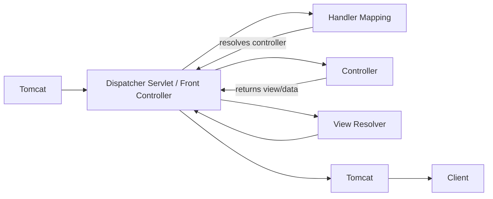

# Chapter 2: Spring Boot

## 2.1 Maven and POM

**Maven** is a dependency management tool.

**POM (Project Object Model)** is Maven's configuration file (`pom.xml`), which describes a project's dependencies, plugins, and build settings.

---

## 2.2 Introduction to Spring

The **Spring Framework** is a powerful, lightweight, open-source Java framework used to build enterprise-level applications easily. It provides comprehensive infrastructure support for developing Java applications, and it is built strongly around the principle of **IoC (Inversion of Control)**.

---

## 2.3 IoC (Inversion of Control)

IoC is a principle in which we hand over control of certain parts of our application's logic — in this case, to Spring. Spring controls the application in the way we instruct it to: we provide instructions about *what* it should manage and *how* it should manage it.

In Spring, IoC is expressed in two main ways:

- **Dependency Injection (DI)** — an approach where the framework controls the links (dependencies) between the objects in your application. When one object depends on another, you let the framework manage that dependency for you. This is IoC because Spring is controlling the dependency between objects on your behalf.
- **AOP (Aspect-Oriented Programming)** — the part of Spring that controls intercepting and altering method execution.

---

## 2.4 Context

Spring needs to know which objects in your application it should manage — and that's where the **context** comes in.

- The context is a "bucket" that holds the instances of the classes we let Spring manage.
- Every instance in the context has a unique identifier; you can also assign aliases, though they aren't used very often.
- One common implementation of the context is `AnnotationConfigApplicationContext`, which lets you define the context based on annotations.

```java
var context = new AnnotationConfigApplicationContext();
var context = new AnnotationConfigApplicationContext(Class c);
```

- You provide instructions for the context in a **configuration class**, and pass that config class to the context's constructor.
- To mark a class as a configuration class, add the `@Configuration` annotation on top of it. This tells Spring that the class isn't an ordinary class, but one used to define configuration.

### 2.4.1 Beans

**Beans** are simply objects managed by the Spring context.

**Types of beans:** Singleton beans and Prototype beans.

**Defining beans in the context:**

**a. Creating beans with methods**

1. In the configuration class, create a method annotated with `@Bean`. It should return an instance of the class you want available in the context. The method's name becomes the unique identifier used to retrieve that bean.
2. When you call `context.getBean(Xyz.class)`, the context checks whether it has a bean of that type. If it does, it returns the bean produced by the corresponding method; otherwise, it throws an exception.
3. If there are multiple beans of the same class, you must specify the bean's name to retrieve the one you want:

   ```java
   LoginController bean = context.getBean("loginController1", LoginController.class);
   ```

4. You can create beans using methods that take parameters — this is typically used for autowiring dependencies between beans.

**b. Creating beans with stereotype annotations**

1. Add the `@Component` annotation on top of the class you want a bean created for.
2. By default, Spring does not scan for this kind of annotation.
3. So, on the configuration class, you need to define `@ComponentScan(basePackages = "path.of.directory.to.scan")`.
4. With stereotype annotations, you cannot create multiple beans of the same type.
5. Stereotype annotations only work for user-defined classes, not for predefined (third-party) classes.
6. You should prefer stereotype annotations in all cases except the two situations above.

---

## 2.5 Common Stereotypes in a Layered Application

| Stereotype | Responsibility |
|---|---|
| **Controller** | Defines endpoints — HTTP methods and paths — that delegate to a specific use case implemented in the service class |
| **Repository** | Objects that manage database operations; you write the queries here |
| **Model** | Objects that describe the data, mapped to a database table |
| **Service** | Objects where the main operational/business logic lives |

---

## 2.6 Dependency Injection

**Dependency Injection (DI)** means taking fields from the context and using them in other classes. It's how we achieve IoC over variables.

There are three ways to perform DI:

### 2.6.1 Field Injection

- Add `@Autowired` on top of the field you want a bean injected into. *(Not recommended.)*
- With field injection, the instance remains mutable and can be modified further down in the code, which is why it isn't recommended.
- It's recommended for use in **unit tests**.
- It uses Java's default constructor to create objects, then uses reflection to inspect the class's fields and constructors, and makes decisions based on what it finds.

### 2.6.2 Constructor-Based Injection (Most Recommended)

- Declare the field as `private final`, initialize it in the constructor, and put `@Autowired` on the **constructor** — not on the field. This is the recommended approach because it keeps the field immutable.
- From Spring 5 onward, you don't even need `@Autowired` on the constructor — Spring automatically resolves and injects the required instance from the context.
- This works automatically only if the class has a single constructor. If there's more than one constructor, you must explicitly tell Spring which one to use for DI.

### 2.6.3 Getter/Setter-Based Injection

- Declare the field and create a getter/setter for it, then annotate the setter with `@Autowired`.
- This doesn't solve the mutability problem either — the field remains mutable — so constructor-based DI is always preferred.

---

## 2.7 The `@Qualifier` Annotation

Suppose we have two beans of the same class, and we're autowiring one of them into another class — how does Spring know which instance to use?

This is where `@Qualifier` comes in:

- Add `@Qualifier` on top of a `@Bean` method to give that instance a name.
- Then add the same `@Qualifier` annotation (with the desired bean name) next to `@Autowired` on the field.
- If you're using `@Component` to create the bean, you can put `@Qualifier` at the class level instead.

## 2.8 The `@Primary` Annotation

If you have multiple beans of the same type and need to specify which one should be used by default, use `@Primary` — either on top of a `@Bean` method, or at the class level alongside `@Component`.

> **Note:** When there are multiple beans of the same type, you must use either `@Qualifier` or `@Primary` — one of the two is mandatory.

---

## 2.9 Circular Dependency Issues

A **circular dependency** happens when two objects reference each other — e.g., `Service1` injects `Service2`, and `Service2` injects `Service1`.

- With constructor-based DI, when Spring tries to create `Service1`, it needs an instance of `Service2` first. But `Service2` needs an instance of `Service1` — this is the circular dependency.
- **The solution** is to decouple responsibilities: create a new class that both dependent classes can use, instead of depending directly on each other.
- Don't try to "solve" circular dependencies with field injection — it will technically work, but it creates bigger problems than the circular dependency itself.
- The only real fix is to extract a new class and have both original classes depend on it instead.

> *For hands-on DI examples, refer to the `spring-practice-DI` project.*

---

## 2.10 Aspects (AOP)

**Aspects** deal with controlling method execution — think of it as IoC applied to method execution.

- An aspect is a piece of logic that sits between the caller and the object being called, and can alter how that method executes.
- It's logic that runs whenever a specific method is called. To create such a class, annotate it with `@Aspect`.
- `@Aspect` is **not** a stereotype annotation, so it will not create a bean on its own — you need to explicitly annotate the class with `@Component`, or define a `@Bean` method for it in the config class.
- Inside an aspect class, you write methods that should run before, after, or around the execution of other methods. You tell Spring which method the aspect should apply to.
- To enable aspects, annotate the configuration class with `@EnableAspectJAutoProxy`. Without this annotation, methods run normally, and aspects are ignored.
- When you call a method through an object that has aspects applied to it, you're not calling the real object directly — Spring gives you a **proxy** object that wraps the original and can intercept the call.

```
Caller object -> Proxy object (created by Spring, can alter execution) -> Target object
```

### 2.10.1 Aspect Syntax

```java
// JOIN POINT
@Before("execution(* controllers.DemoController.doubleValue(..))") // POINTCUT
public void before() {
    // ASPECT LOGIC
    System.out.println("HELLO");
}
```

- `@Before` is the **join point** — it defines *when* the aspect logic runs.
- The string passed to `@Before` describes the method to intercept — this is called the **pointcut**.

### 2.10.2 Join Points in Aspects

| Join Point | Behavior |
|---|---|
| `@Before` | Executes before method execution |
| `@After` | Executes after method execution |
| `@AfterReturning` | Executes only if the method completes without throwing an exception |
| `@AfterThrowing` | Executes only if an exception is thrown |
| `@Around` | The most powerful join point — wraps the entire method execution. Use it only when the first four options aren't sufficient; `@Around` can do everything they can do |

**`@Around` example:**

```java
@Around("execution(* controllers.DemoController.doubleValue(..))")
public void around(ProceedingJoinPoint pjp) throws Throwable {
    System.out.println(":)");
    pjp.proceed();
    System.out.println(":(");
}
```

- `@Around` requires a parameter of type `ProceedingJoinPoint`.
- `pjp.proceed()` invokes the original method described in the pointcut. You can also pass arguments to `proceed()` as an object array.
- If you don't call `proceed()`, the original method's logic is never executed — it is effectively replaced by whatever the `@Around` method does instead.

> *For hands-on aspect examples, refer to the `spring-practice-aspects` project.*

---

## 2.11 Singleton and Prototype Beans

- Most real-world applications rely on **singleton** beans — this is Spring's default bean scope.
- You can also use **prototype** beans by defining the bean's scope with `@Scope("prototype")`. Each time you request the bean from the context, you get a brand-new instance.
- If you create an instance using the `new` keyword directly, that instance is unknown to the Spring context, and none of Spring's features (DI, aspects, etc.) will work on it.
- Singleton beans use **eager instantiation** by default — they're created as soon as the context starts. You can change this behavior with the `@Lazy` annotation (used alongside `@Component`), which tells Spring to create the bean only when it's first requested.

---

## 2.12 Introduction to Spring Boot

Spring Boot is a framework built on top of the Spring Framework that simplifies the process of building production-ready Spring applications quickly and easily.

- It follows **convention over configuration**: Spring Boot works with sensible, pre-configured defaults that fit the majority of use cases, and you can customize them as needed.
- In Spring Boot, convention comes first, and configuration is a second step you only take when it's actually needed.
- Much of the manual configuration that plain Spring requires is taken care of for you.
- It's essentially a Maven project that comes with a few things pre-built: essential dependencies in `pom.xml`, and the `SpringApplication.run(Main.class, args)` method in the main class.
  - The `run()` method creates the context and performs the necessary configuration behind the scenes.
  - `@SpringBootApplication` on the main class is a wrapper annotation that bundles together several other annotations required for configuration.
- Spring Boot gives you a functional application that starts up and, behind the scenes, configures and boots a servlet container — Tomcat, by default.
- You just start the application, and behind the scenes you get a fully configured Tomcat server and the full Spring MVC architecture.

---

## 2.13 Tomcat and the Dispatcher Servlet

- **Tomcat** is what a web application needs to receive HTTP requests and return HTTP responses — it acts as the translator between HTTP and your application.
- In the days before Spring Boot, you had to configure Tomcat so that it received the HTTP request and routed it to the correct servlet, where the business logic for that request lived. Tomcat then returned the response along that same path.
- Today, there's just **one** servlet: the **Dispatcher Servlet** (also called the **Front Controller**). Tomcat is decoupled from application logic — every request is sent to the Dispatcher Servlet, which is responsible for routing it appropriately.
- Instead of Tomcat managing servlets and being responsible for routing and application logic, it simply forwards the request to the Dispatcher Servlet, which figures out who should handle it and sends the response back through Tomcat.

**Request flow:**



- From the Dispatcher Servlet, the request goes to **Handler Mapping**: the Dispatcher Servlet asks Handler Mapping which controller should handle this request, and Handler Mapping returns the mapping between the request and the controller.
- The Dispatcher Servlet then calls the appropriate controller. After the controller finishes executing, it hands back the response that needs to be rendered.
- The Dispatcher Servlet uses a component called the **View Resolver** to find the correct view to render, assembles everything, and sends the final response back to Tomcat.
- This design moves responsibility away from Tomcat and into the application, leaving Tomcat as a simple translator — a design that greatly simplifies the overall architecture.

---

## 2.14 The `application.properties` File

- Used to describe environment-specific properties.
- You can have as many properties files as you like — a separate one for each environment.
- For environment-specific files, name them like `application-dev.properties`, and pass `-Dspring.profiles.active=dev` as a VM option. When you run the application, it will pick up properties from `application-dev.properties`. Without this flag, Spring Boot falls back to the default properties file.
- If a property isn't defined in the environment-specific file, Spring Boot falls back to the value in the default properties file.

---

## 2.15 HikariDataSource

`HikariDataSource` is the default connection-pooling mechanism Spring Boot uses to connect to a data source.

---

## 2.16 REST APIs

A **REST API** (Representational State Transfer) is a web service that:

- Uses HTTP methods (`GET`, `POST`, `PUT`, `DELETE`) for CRUD operations.
- Returns data, most commonly in JSON format.

### 2.16.1 Annotations for REST APIs in Spring Boot

| Annotation | Purpose |
|---|---|
| `@RestController` | A combination of `@Controller` + `@ResponseBody`. Marks a class as a REST controller where each method returns a JSON object instead of a view |
| `@RequestMapping` | Used at the class or method level to map HTTP requests to handler methods |
| `@GetMapping` | Shorthand for `@RequestMapping(method = RequestMethod.GET)` — used for reading data |
| `@PostMapping` | Shorthand for `@RequestMapping(method = RequestMethod.POST)` — used for creating data |
| `@PutMapping` | Shorthand for `@RequestMapping(method = RequestMethod.PUT)` — used for updating existing resources |
| `@DeleteMapping` | Shorthand for `@RequestMapping(method = RequestMethod.DELETE)` — used for deleting resources |

### 2.16.2 Handling Requests

1. **Request Parameters** — query parameters passed in the URL after `?`.
   - Example: `http://localhost:8080/api/users?name=vaishnav&age=23`
   - `@RequestParam` maps query parameters to method parameters.

2. **Path Variables** — dynamic parts of the URL path.
   - Example: `http://localhost:8080/api/users/5` (here, `5` is a path variable, e.g., a user ID).
   - `@PathVariable` maps URL segments to method parameters.

3. **Request Bodies** — the full JSON payload sent in `POST` or `PUT` requests.
   - `@RequestBody` maps incoming JSON data to a Java object.

### 2.16.3 Handling Responses

- Status codes clearly communicate the result of a client's request. They're a REST API standard that improves readability, debugging, and client-side handling.
- If you simply return an object or a string, Spring Boot automatically returns `200 OK` for successful `GET`/`POST` requests.
- `ResponseEntity` lets you send an HTTP status code, set the response body, and set HTTP headers explicitly.
- **2xx** codes represent success, **4xx** codes represent client-side errors, and **5xx** codes represent server-side issues.

**Most commonly used status codes in Spring Boot REST APIs:**

| Code | Meaning |
|---|---|
| 200 OK | Successful GET or PUT |
| 201 Created | Successful POST that creates a resource |
| 204 No Content | Successful DELETE |
| 400 Bad Request | Invalid client-side data |
| 401 Unauthorized | Authentication needed |
| 403 Forbidden | Insufficient permissions |
| 404 Not Found | Resource missing |
| 409 Conflict | Duplicate or conflicting request |
| 500 Internal Server Error | Unexpected server failure |

---

## 2.17 Calling External APIs from a Spring Boot Application

### 2.17.1 RestTemplate

`RestTemplate` is a synchronous HTTP client provided by Spring, used to:

- Consume REST web services easily.
- Perform `GET`, `POST`, `PUT`, and `DELETE` operations.
- Convert JSON/XML responses into Java objects using `HttpMessageConverters` internally (Jackson, for JSON).

**Commonly used `RestTemplate` methods:**

| Method | Purpose |
|---|---|
| `getForObject(url, class)` | GET request; returns the response mapped to a class |
| `getForEntity(url, class)` | GET request; returns a `ResponseEntity` (status, headers, body) |
| `postForObject(url, request, class)` | POST request; returns the mapped response |
| `postForEntity(url, request, class)` | POST request; returns a `ResponseEntity` |
| `put(url, request)` | PUT request; no response body |
| `delete(url)` | DELETE request |
| `exchange()` | Flexible method supporting any HTTP method with full control |
| `execute()` | Lowest-level method, for advanced use cases |

**`restTemplate.exchange()`:**

`exchange()` is the most powerful `RestTemplate` method, giving you full control over the HTTP request and response. Use it whenever you need to set headers, choose the HTTP method explicitly, or send a request entity.

It lets you:

- Specify the HTTP method (GET, POST, PUT, DELETE, etc.)
- Set custom headers
- Send a request body
- Specify the response type
- Access the full `ResponseEntity` (status code, headers, body)

```java
@GetMapping("/consume-exchange")
public String consumeApiExchange() {
    String url = "https://jsonplaceholder.typicode.com/posts/1";

    HttpHeaders headers = new HttpHeaders();
    headers.set("Accept", "application/json");

    HttpEntity<String> entity = new HttpEntity<>(headers);

    ResponseEntity<String> response = restTemplate.exchange(
            url,
            HttpMethod.GET,
            entity,
            String.class
    );

    System.out.println("Status: " + response.getStatusCode());
    System.out.println("Headers: " + response.getHeaders());

    return response.getBody();
}
```

Here, `HttpEntity<String> entity = new HttpEntity<>(headers)` creates a request with custom headers and no body. `exchange()` sends a GET request with these headers and maps the response to a `String`.

### 2.17.2 WebClient

- Supports asynchronous and reactive streams.
- More flexible and powerful than `RestTemplate`.
- Well suited to microservices communication under high concurrency.

**GET request example:**

```java
@RestController
@RequestMapping("/api")
public class ConsumeController {

    @Autowired
    private WebClient.Builder webClientBuilder;

    @GetMapping("/consume")
    public Mono<String> consumeApi() {
        return webClientBuilder.build()
                .get()
                .uri("https://jsonplaceholder.typicode.com/posts/1")
                .retrieve()
                .bodyToMono(String.class);
    }
}
```

Here: `.get()` issues an HTTP GET, `.uri()` sets the target URL, `.retrieve()` initiates the request and prepares for response handling, and `.bodyToMono(String.class)` converts the response body into a `Mono<String>`.

**POST request example:**

```java
@PostMapping("/create-post")
public Mono<Post> createPost(@RequestBody Post post) {
    return webClientBuilder.build()
            .post()
            .uri("https://jsonplaceholder.typicode.com/posts")
            .body(Mono.just(post), Post.class)
            .retrieve()
            .bodyToMono(Post.class);
}
```

Here, `.body(Mono.just(post), Post.class)` sets the request body.

---

## 2.18 Scheduling and Asynchronous Tasks

### 2.18.1 `@Scheduled`

An annotation used to schedule methods to run at fixed intervals or according to cron expressions. Enables periodic tasks like:

- Sending emails every hour
- Daily database clean-up jobs
- Batch data processing

### 2.18.2 `@Async`

Runs a method on a separate thread, asynchronously, allowing:

- Non-blocking calls
- Parallel processing without waiting for completion

Calling an `@Async` method returns immediately, while the task continues running on a separate thread.

---

## 2.19 Spring Boot Best Practices

### 2.19.1 Layered Architecture

Follows separation of concerns by dividing the codebase into distinct layers:

| Layer | Responsibility |
|---|---|
| Controller | Handles HTTP requests and responses |
| Service | Contains business logic |
| Repository | The data access layer that interacts with the database |

This approach gives you:

- Better readability
- The ability to test each layer independently
- Scalability as the project grows

### 2.19.2 Exception Handling Strategy

- Provides consistent, meaningful error responses to clients.
- Avoids exposing stack traces or internal implementation details.
- Can be achieved with `@ControllerAdvice`.
- Use custom exception classes, such as `ResourceNotFoundException` and `InvalidRequestException`.
- Return a standard error structure (timestamp, message, status code) to API consumers.

### 2.19.3 Externalized Configuration

- Keeps configuration outside the codebase, so it can change independently across environments (dev, QA, prod).
- Never hard-code credentials — use environment variables or a secrets vault.
- Maintain separate configuration files per environment (`application-dev.yml`, `application-prod.yml`).

### 2.19.4 Clean Code and SOLID Principles

**SOLID Principles:**

| Principle | Meaning |
|---|---|
| Single Responsibility | One class → one responsibility |
| Open/Closed | Open for extension, closed for modification |
| Liskov Substitution | Subtypes should be replaceable for their base types without breaking behavior |
| Interface Segregation | Prefer many small interfaces over one large, "fat" interface |
| Dependency Inversion | Depend on abstractions, not concrete classes |

**Clean code practices:**

- Use meaningful method and variable names.
- Avoid large classes — split them into smaller, focused components.
- Write unit tests.
- Remove dead code and commented-out blocks.
- Follow the Controller → Service → Repository flow.

### 2.19.5 Versioning REST APIs

Versioning APIs supports backward compatibility while you add new features. The most common approach is **URI versioning**:

```java
@RequestMapping("/api/v1/users")
public class UserControllerV1 { }

@RequestMapping("/api/v2/users")
public class UserControllerV2 { }
```

---

## 2.20 Global Exception Handling

### 2.20.1 `@ExceptionHandler`

A Spring MVC annotation used to handle exceptions within a controller. Placing it on a method tells Spring: *"If this exception occurs, call this method to handle it instead of letting it propagate."*

```java
@RestController
public class UserController {

    @GetMapping("/user/{id}")
    public String getUser(@PathVariable int id) {
        if (id <= 0) {
            throw new IllegalArgumentException("Invalid ID");
        }
        return "User-" + id;
    }

    @ExceptionHandler(IllegalArgumentException.class)
    public ResponseEntity<String> handleIllegalArgument(IllegalArgumentException ex) {
        return new ResponseEntity<>("Error: " + ex.getMessage(), HttpStatus.BAD_REQUEST);
    }
}
```

### 2.20.2 `@ControllerAdvice`

A specialized annotation that lets you apply global exception handling, data binding, and model attributes across **all** controllers in a Spring Boot application. It's part of Spring MVC — think of it as a global interceptor for controllers.

- Without `@ControllerAdvice`, you'd need to write `@ExceptionHandler` methods in every controller, leading to code duplication and harder maintenance.
- With `@ControllerAdvice`, all exception-handling logic can live in one centralized class.

**How it works:**

1. You annotate a class with `@ControllerAdvice`.
2. Inside it, you define `@ExceptionHandler` methods for specific exceptions.
3. When an exception is thrown inside any controller, Spring looks for a matching `@ExceptionHandler` method inside a `@ControllerAdvice` class.
4. If a match is found, it's executed and its response is returned. If not, Spring falls back to its default error handling.

**Example workflow:**

1. A user calls your API endpoint.
2. The controller's logic throws a `UserNotFoundException`.
3. Spring checks the `@ControllerAdvice` class.
4. It finds a matching `@ExceptionHandler(UserNotFoundException.class)`.
5. That method executes, builds an appropriate response, and sends it back to the client.

```java
@ControllerAdvice
public class GlobalExceptionHandler {

    // Handles a specific exception
    @ExceptionHandler(UserNotFoundException.class)
    public ResponseEntity<String> handleUserNotFound(UserNotFoundException ex) {
        return new ResponseEntity<>("User not found: " + ex.getMessage(), HttpStatus.NOT_FOUND);
    }

    // Handles another exception
    @ExceptionHandler(InvalidRequestException.class)
    public ResponseEntity<String> handleInvalidRequest(InvalidRequestException ex) {
        return new ResponseEntity<>("Invalid request: " + ex.getMessage(), HttpStatus.BAD_REQUEST);
    }

    // Catch-all exception handler
    @ExceptionHandler(Exception.class)
    public ResponseEntity<String> handleGeneralError(Exception ex) {
        return new ResponseEntity<>("Something went wrong: " + ex.getMessage(),
                                    HttpStatus.INTERNAL_SERVER_ERROR);
    }
}
```

### 2.20.3 `@ControllerAdvice` vs. `@RestControllerAdvice`

| | `@ControllerAdvice` | `@RestControllerAdvice` |
|---|---|---|
| Works with | Both MVC (views) and REST APIs | REST APIs |
| JSON output | Not returned by default, unless you wrap responses in `ResponseEntity` or annotate methods with `@ResponseBody` | Always returns JSON/XML (more common in REST APIs) |
| Definition | Base annotation | Shorthand for `@ControllerAdvice` + `@ResponseBody` |
