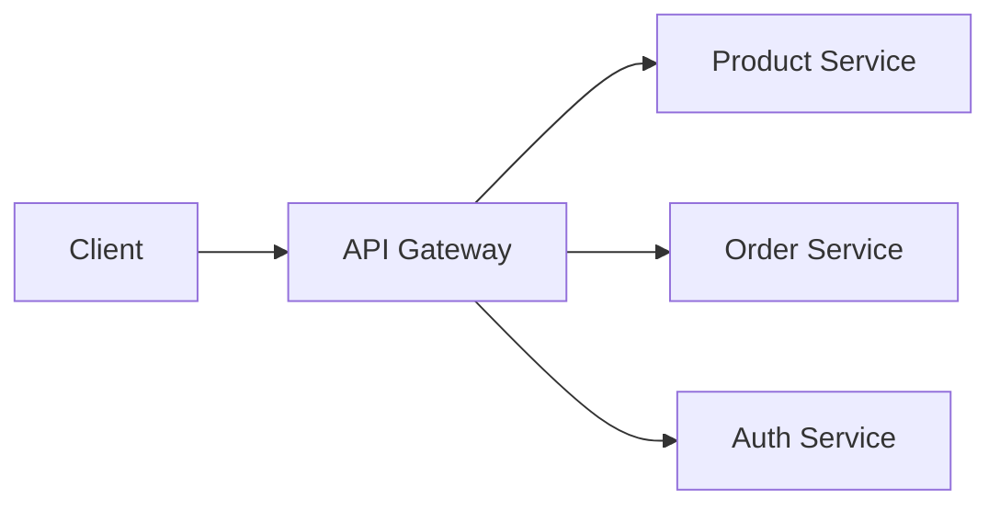

# Chapter 4: Spring Microservices

## 4.1 Introduction to Microservices

Microservices is an architectural style in which an application is structured as a collection of small, autonomous services. Each service is:

- **Independent** — it can be developed, deployed, and scaled separately.
- **Focused on a single business capability.**
- Able to **communicate with other services** using lightweight protocols like HTTP/REST, gRPC, or message queues.

### 4.1.1 The Monolithic Alternative

Traditional applications used to be **monolithic**, where:

- All features (login, order, payment, etc.) are part of a single codebase.
- One failure could bring down the whole application.
- Scaling is hard — you have to scale the entire application, even if only one part needs it.

Microservices solve these problems:

| Feature | Monolithic | Microservices |
|---|---|---|
| Codebase | One large app | Many smaller apps |
| Deployment | One unit | Independently deployable |
| Scalability | Scale the whole app | Scale individual services |
| Development | Slower, tightly coupled | Faster, autonomous teams |
| Technology stack | Usually one | Each service can use a different stack (Java, Node.js, etc.) |

### 4.1.2 Example: An E-Commerce System

Instead of one large application, you split it into services:

- **User Service** – handles user accounts
- **Product Service** – manages the product catalog
- **Cart Service** – stores shopping cart information
- **Payment Service** – handles payments
- **Notification Service** – sends emails/SMS

Each service:

- Has its own database.
- Communicates with the others via REST or messaging.
- Can be deployed independently.

### 4.1.3 Key Characteristics of Microservices

| Characteristic | Description |
|---|---|
| Independent Deployability | Services can be updated or deployed without affecting others |
| Decentralized Data Management | Each service manages its own database |
| Resilience | A failure in one service shouldn't crash the whole system |
| Scalability | You can scale services individually, based on their load |
| Technology Diversity | Each team can pick the tools/tech that suit them |
| DevOps Alignment | Encourages CI/CD and automation |
| Business-Oriented | Services align with business capabilities |

### 4.1.4 Communication Between Microservices

1. **REST API (Synchronous)** — e.g., `ProductService` calls `InventoryService` over HTTP.
2. **Message Brokers (Asynchronous)** — tools like RabbitMQ or Kafka, useful for events (e.g., "Order Placed").

### 4.1.5 Challenges with Microservices

| Challenge | Description |
|---|---|
| Distributed System Complexity | Debugging and tracing across services is hard |
| Data Consistency | There's no single database, so you need eventual consistency |
| Latency | Inter-service communication adds delay |
| Deployment Overhead | More pipelines, more configuration |
| Service Discovery & Load Balancing | Needs tools like Eureka, Ribbon, or Kubernetes |

### 4.1.6 Tools and Technologies Commonly Used

- **Spring Boot** – build each service
- **Spring Cloud** – tooling for microservices (Eureka, Config Server, etc.)
- **Docker** – package each service
- **Kubernetes** – deploy and manage services
- **Netflix OSS** – Eureka (discovery), Zuul (gateway), Hystrix (circuit breaker)
- **API Gateway** – a single entry point for all services
- **Message Brokers** – RabbitMQ, Apache Kafka

---

## 4.2 Monolith vs. Microservices

These are two different architectural styles used to design and build applications.

### 4.2.1 Monolithic Architecture

A monolith is a single, unified application where all features are part of one codebase and deployed as a single unit.

**Example:** An e-commerce monolith might bundle User Management, Product Catalog, Shopping Cart, Payment, and Notifications all into one application, deployed as a single WAR or JAR.

**Advantages:**
- Easy to develop and deploy (at a small scale)
- Easier to test (a single application)
- Simple to debug (centralized logging)

**Disadvantages:**
- Difficult to scale specific parts — you must scale the entire app
- Any small change requires a full redeployment
- Hard to understand and manage as the codebase grows
- Not well suited to large teams (merge conflicts, tight coupling)

### 4.2.2 Microservices Architecture

Microservices break the monolith into small, loosely coupled services, each handling a specific business capability.

**Example:** That same e-commerce app becomes a User Service, Product Service, Cart Service, Payment Service, and Notification Service — each of which:

- Has its own database
- Runs in its own process
- Communicates via HTTP (REST) or messaging (Kafka, RabbitMQ)
- Can be deployed independently

**Advantages:**
- **Scalability** — scale services independently (e.g., only scale `ProductService` if needed)
- **Flexibility** — use different tech per service (Java, Node.js, Python, etc.)
- **Faster development** — smaller codebases, faster iterations
- **Resilience** — a failure in one service doesn't crash the whole app
- **Team independence** — teams can own and deploy their own service

**Disadvantages:**
- More complex infrastructure (discovery, API gateway, configuration)
- It's a distributed system — harder to debug and test
- Data consistency is tricky (no single database)
- Requires DevOps maturity (CI/CD, monitoring, logging)

### 4.2.3 When to Use What

| Use a Monolith When... | Use Microservices When... |
|---|---|
| The project is small or an MVP | It's a large-scale system |
| The team is small | Multiple teams work across domains |
| You want fast, simple delivery | You need scalability and flexibility |
| Deployment is simple | CI/CD and DevOps practices are already in place |

---

## 4.3 Microservice Architecture Patterns

These patterns help microservices communicate, scale, and stay resilient in production.

### 4.3.1 API Gateway

An **API Gateway** is a single entry point for all client requests to the backend microservices. Instead of clients calling services directly, they call the gateway.

**Responsibilities:**
- Route requests to the appropriate services
- Handle authentication and authorization
- Perform rate limiting
- Enable load balancing
- Return aggregated responses

**Common tool:** Spring Cloud Gateway (Java)



**Benefits:**
- Simplifies client-side logic
- Centralizes cross-cutting concerns (security, logging, etc.)
- Makes versioning and monitoring easier

### 4.3.2 Service Registry & Discovery

A **Service Registry** keeps a dynamic list of available services and their locations (IP + port). Services register themselves on startup and discover others at runtime.

**Tools:** Eureka (Netflix OSS), Consul, Zookeeper, Kubernetes' built-in Service Discovery

**Components:**
- **Service Registry** – the central database of services (like a phonebook)
- **Service Instance** – microservices register themselves here
- **Service Discovery Client** – finds other services via the registry

**Types:**
- **Client-side discovery** (e.g., Netflix Eureka + Ribbon)
- **Server-side discovery** (e.g., Kubernetes Services + Ingress)

**Benefits:**
- No need to hard-code service URLs
- Supports dynamic scaling
- Enables fault-tolerant service lookups

### 4.3.3 Config Server (Centralized Configuration Management)

A **Config Server** is a centralized place to manage externalized configuration for all microservices. Instead of storing configuration inside each app, services pull it from this server at runtime or startup.

**Tool:** Spring Cloud Config Server — reads configuration from Git, Vault, or the filesystem.

**Benefits:**
- A single source of truth for configuration
- Dynamic refresh of properties (with Spring Cloud Bus)
- Avoids configuration duplication
- Supports environment-specific properties (dev, QA, prod)

### 4.3.4 Circuit Breaker

A **Circuit Breaker** protects your system from cascading failures. If a service becomes slow or starts failing, the circuit breaker trips and temporarily blocks further requests to it.

**Tool:** Resilience4j (the preferred choice for Spring Boot)

**Key states:**
- **Closed** – requests flow normally
- **Open** – requests are blocked, and a fallback is returned instead
- **Half-Open** – the system tests whether the service has recovered

```java
@CircuitBreaker(name = "paymentService", fallbackMethod = "fallback")
public String callPaymentService() {
    // REST call to PaymentService
}
```

**Benefits:**
- Prevents resource exhaustion
- Improves system stability and user experience
- Can return cached or default responses during a failure

### 4.3.5 Load Balancer

A load balancer distributes traffic across multiple instances of a microservice to ensure high availability and performance.

**Types:**
- **Client-side load balancing** — the balancing logic lives inside the calling service. Tools: Ribbon, Feign.
- **Server-side load balancing** — an external system balances the load. Tools: NGINX, HAProxy, Kubernetes Ingress.

**Goal:**
- Evenly distribute requests
- Avoid overloading any single service instance
- Enable scalability and fault tolerance

**Benefits:**
- Improves system throughput
- Automatically reroutes traffic if an instance fails
- Enables horizontal scaling

---

## 4.4 Communication Between Services

In microservices, services often need to talk to each other — this is called **inter-service communication**. Spring Boot offers three popular, synchronous, HTTP-based approaches:

- `RestTemplate` (legacy, but still used)
- **Feign Client** (recommended)
- `WebClient` (modern, reactive)

### 4.4.1 RestTemplate (Basic Way)

A simple, blocking (synchronous) HTTP client used to send HTTP requests from one service to another.

```java
@RestController
public class OrderController {

    @Autowired
    private RestTemplate restTemplate;

    @GetMapping("/order")
    public String placeOrder() {
        String productInfo = restTemplate.getForObject(
            "http://PRODUCT-SERVICE/product", String.class);
        return "Order placed with: " + productInfo;
    }
}
```

**Characteristics:**
- Easy to use
- Fully synchronous (blocks the calling thread)
- Good for quick HTTP calls
- Doesn't support service discovery directly — you must know the exact URL, or combine it with Ribbon

**Limitations:**
- Deprecated in favor of `WebClient`
- No built-in retry, circuit breaker, or load balancing (unless combined with Ribbon/Resilience4j)

### 4.4.2 Feign Client (Declarative, Recommended)

Feign is a declarative HTTP client, originally developed by Netflix and now supported by Spring Cloud. It lets you call other microservices by writing simple Java interfaces — no manual HTTP boilerplate required.

It's tightly integrated with Spring Cloud and supports:
- Service Discovery
- Load Balancing
- Circuit Breaker integration (Resilience4j)

**Benefits:**
- Clean, readable, interface-based code
- Integrates with Eureka for service discovery
- Works well with Resilience4j/Hystrix
- Supports fallback methods

**Limitations:**
- Synchronous (not reactive)
- Not ideal for streaming or large payloads

```java
@FeignClient(name = "product-service")
public interface ProductClient {
    @GetMapping("/product")
    String getProduct();
}
```

**How Feign works under the hood:**
- Feign uses dynamic proxies to implement interfaces at runtime.
- When you inject a Feign client and call a method, it makes a REST HTTP call behind the scenes.
- If you're using Eureka, Feign automatically resolves the service name to an IP/port via service discovery.

#### Step-by-Step Setup

**1. Add the Maven dependency:**

```xml
<dependency>
    <groupId>org.springframework.cloud</groupId>
    <artifactId>spring-cloud-starter-openfeign</artifactId>
</dependency>
```

**2. Enable Feign in the main class:**

```java
@SpringBootApplication
@EnableFeignClients
public class OrderServiceApplication {
    public static void main(String[] args) {
        SpringApplication.run(OrderServiceApplication.class, args);
    }
}
```

**3. Create a Feign client interface:**

```java
@FeignClient(name = "product-service")  // 'name' should match the Eureka service ID
public interface ProductClient {

    @GetMapping("/product/{id}")
    Product getProductById(@PathVariable("id") Long id);
}
```

This interface is enough — Feign generates the implementation for you.

**4. Use the Feign client:**

```java
@RestController
public class OrderController {

    @Autowired
    private ProductClient productClient;

    @GetMapping("/order/{productId}")
    public String placeOrder(@PathVariable Long productId) {
        Product product = productClient.getProductById(productId);
        return "Order placed for product: " + product.getName();
    }
}
```

If you're not using Eureka (or any service discovery), Feign needs to know the exact URL of the target service. In that case, configure the base URL manually in `application.yml` or `application.properties`:

```java
@FeignClient(name = "productClient", url = "${product.service.url}")
public interface ProductClient {

    @GetMapping("/product/{id}")
    Product getProductById(@PathVariable("id") Long id);
}
```

```properties
# application.properties
product.service.url=http://localhost:8081
```

The request will then be sent to: `http://localhost:8081/product/{id}`

### 4.4.3 WebClient (Reactive Way — Modern)

A non-blocking, asynchronous, reactive HTTP client, introduced as part of Spring WebFlux.

```java
@Autowired
private WebClient.Builder webClientBuilder;

@GetMapping("/order")
public Mono<String> placeOrder() {
    return webClientBuilder.build()
        .get()
        .uri("http://product-service/product")
        .retrieve()
        .bodyToMono(String.class);
}
```

**Benefits:**
- Non-blocking and highly performant
- Ideal for high-concurrency scenarios
- Works with Reactor's `Mono` and `Flux` types
- Supports streaming, parallel calls, and more

**Limitations:**
- Harder to debug than synchronous methods
