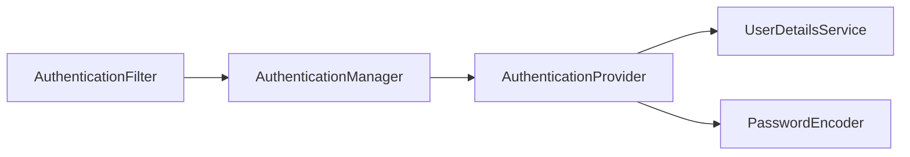
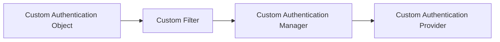

# Chapter 5: Spring Security

## 5.1 Introduction

Spring Security is all about application-level security. It is divided into two levels:

1. **Authentication** – The logic in the application that figures out who the user is that is trying to access the application, and whether that user is allowed to access it at all.
2. **Authorization** – Providing access to particular resources or functions based on the user's authority or role.

In microservices, we secure the API endpoints themselves.

---

## 5.2 HTTP Basic Authentication

### 5.2.1 Providing Credentials

- To know how to provide credentials, we first need to know which type of authentication the application is using.
- By default, Spring Security uses **HTTP Basic** authentication.
- With HTTP Basic, credentials are sent in the HTTP headers, Base64-encoded.
- In Postman, you can go to the **Authorization** tab, select **Basic Auth**, and provide the credentials directly.
- By default, the username is always `user`, and if no password configuration is provided, Spring Security generates a random password for you.

### 5.2.2 How It Works

- When Basic Auth is selected in Postman, a (usually hidden) header called `Authorization` is created, with a value in the format:

  ```
  Basic <Base64-encoded "username:password">
  ```

- Base64 is an **encoding**, not an **encryption**.

---

## 5.3 Encoding vs. Encryption vs. Hash Functions

### 5.3.1 Encoding

- Encoding is a function that can always be reversed. It is a mathematical transformation that does not require any secret to be reverted.
- If you know the rule or pattern used to transform the input, you can always recover the original input from the output.

### 5.3.2 Encryption

- Encryption also transforms an input into an output, but to go back from output to input, a **secret** is always required.
- It can be thought of as a more specific, secured form of encoding — one that always needs a secret (key) to reverse.

### 5.3.3 Hash Functions

- With a hash function, you can always go from input to output, but you can **never** go back from output to input.
- The same input is always transformed into the same output.
- Hash functions are the preferred way to store passwords: the input is hashed and compared to the stored hashed output, rather than being decrypted and compared directly.

> **Note:** In real-world applications, we never rely on plain HTTP Basic alone — we always use HTTPS to make sure that whatever is sent over the wire is encrypted.

---

## 5.4 Creating a Custom Set of Credentials (Basic Auth)

*[Refer to Example Project 1]*

1. Create your own `UserDetailsService` — a component that manages user details and tells Spring Security where to get them from.
2. Register a bean of type `UserDetailsService` in the context. This interface tells Spring Security how to manage user credentials; several built-in classes extend or implement it.
3. This contract has a single method that takes a `username` (the unique identifier) and returns a `UserDetails` object containing everything the application needs to know about that user.
4. Create the user using the `User` class provided by Spring Security.
5. Create your own `PasswordEncoder` bean.

> **Note:** Once you define your own user management, Spring Security will no longer generate a random password for you.

---

## 5.5 Authentication Architecture

- Spring Security begins, in web applications, at the level of **filters**.
- Request flow: **Filters → Servlets → Front Controller → rest of the Spring Boot flow.**
- When a request enters the filter chain (a chain of multiple filters), the authentication filter delegates the work to the `AuthenticationManager`.
- The `AuthenticationManager` is an object whose job is to find a way to authenticate the user.
- `AuthenticationManager` is implemented via one or more `AuthenticationProvider` objects. There is only **one** `AuthenticationManager`, but there can be **multiple** `AuthenticationProvider`s.
- Whenever an `AuthenticationProvider` needs a username and password, it uses two components: `UserDetailsService` and `PasswordEncoder`.
- If authentication succeeds, the resulting `Authentication` object is stored in the `SecurityContext`.



---

## 5.6 UserDetailsService

*[Refer to Example Project 2]*

- `UserDetailsService` has a single method: `loadUserByUsername(String username)`, which takes a username and returns a `UserDetails` object.
- This is the method we need to implement.
- There are many ways to implement it, but the most common is to load the user from a database.
- To do this, create a service class that implements `UserDetailsService` and implement `loadUserByUsername` to load the user from the DB by username.
- The user loaded from the DB will typically be a JPA entity, but Spring Security only understands objects that implement `UserDetails`.
- So we need to adapt our entity to the `UserDetails` interface — either indirectly, using a DTO, or via the Adapter pattern.

### 5.6.1 Authorities

- **Authorities** are the list of actions a user is allowed to perform.
- The `UserDetails` object has a field called `GrantedAuthorities`.
- Authorities can be represented either as **authorities** or as **roles** — this is purely a conceptual distinction; behind the scenes they work the same way.
  - **Authorities** describe actions, e.g., `read`, `write`, `delete`.
  - **Roles** describe a badge, e.g., `admin`, `client`, `manager`, `visitor`.
- Essentially, it's the same mechanism — you're simply choosing to model authorization around actions or around badges/roles.

---

## 5.7 Defining a Custom Authentication Mechanism

*[Refer to Example Project 3]*

1. Create a custom `Filter`, `AuthenticationManager`, `AuthenticationProvider`, and `Authentication` object.
2. In the config class, override the `SecurityFilterChain` bean and add the custom filter to the filter chain.
3. Override the filter's method using the `AuthenticationManager`.
4. In the `AuthenticationManager`, register the provider that supports the custom authentication.
5. In the provider, write the logic for authenticating the `Authentication` object.
6. Once the object is authenticated, save it in the `SecurityContext`.
7. Pass the request on to the next filter using `doFilter()` from the filter chain.



---

## 5.8 Multiple Authentication Providers

*[Refer to Example Project 4]*

Implementing both HTTP Basic (default) and a custom authentication mechanism (e.g., API key):

- **HTTP Basic:** When you create the `httpBasic` bean, Spring creates the security configurer, the filters, and the `AuthenticationManager`/`AuthenticationProvider` with default values. You can override these default values while building the `SecurityFilterChain` bean, and the entire security structure will be created according to your configuration.
- To add more authentication logic, write the additional authentication logic you need, and then wire it into the security configuration.

---

## 5.9 Types of Authorization

There are two types of authorization:

1. **Endpoint-level authorization** — done through the filter chain.
2. **Method-level authorization** — done through AOP (Aspect-Oriented Programming).

In web applications, endpoint-level authorization is what's typically used.

---

## 5.10 Endpoint-Level Authorization

**Architecture:** `AuthenticationFilter → SecurityContext → AuthorizationFilter`

- Endpoint-level authorization happens through the filter chain — this is where the rules are applied.
- `HttpSecurity` has a method called `authorizeHttpRequests`, which specifies how a request should be authorized. When an endpoint is called, the request either passes or fails this authorization check before reaching the controller.
- Authorization rules have two parts:
  - `anyRequest()` — a **matcher** method (which requests this rule applies to).
  - `authenticated()` — the **authorization rule** itself.
- `anyRequest().authenticated()` means: after authentication, whichever user is present in the `SecurityContext` is authorized.

---

## 5.11 Authorization Rules in Detail

*[Refer to Example 5]*

These specify which users should be authorized:

1. **`authenticated()`** — All authenticated users are authorized.
2. **`permitAll()`**
   - This means authentication isn't even required — anything can be let through.
   - However, this will *not* allow access if you try to access it with the wrong username or password.
   - This is because the HTTP request first goes through the authentication filter. If authentication is attempted and succeeds, the `SecurityContext` is created, and then the authorization filter applies its rules.
   - Authentication always happens before authorization: if you send **no** credentials at all, the authentication step is effectively skipped, and if the endpoint is marked `permitAll()`, the authorization filter will allow the request through.
   - But if you *do* attempt authentication (Basic Auth or otherwise) with invalid credentials, the authentication filter will reject the request before it even reaches the authorization filter, so the `permitAll()` rule never gets a chance to apply.
3. **`denyAll()`** — Denies all requests. This doesn't have much use on its own in real-world applications, but can be used to deny requests that aren't explicitly matched elsewhere, or to explicitly block specific ones.
4. **`hasAuthority(GrantedAuthority authority)`** — Allows users who have the specified authority.
5. **`hasAnyAuthority(List<GrantedAuthority> authorities)`** — Allows users who have any of the specified authorities.
6. **`hasRole(String role)`** — Allows users who have the specified role.
7. **`hasAnyRole(List<String> roles)`** — Allows users who have any of the specified roles.
8. **`access(new WebExpressionAuthorizationManager(String rule))`** — Lets you specify an authorization rule as a Spring Expression Language (SpEL) string, enabling complex authorization logic. This is a very powerful rule.

---

## 5.12 Matcher Methods in Detail

*[Refer to Example 6]*

Matcher methods specify **which** API endpoints a given authorization rule applies to.

- **`requestMatchers(String... patterns)`**
  - Specifies which APIs to authorize and which authorization rules apply to them. Different rules can be applied to different APIs, and patterns can be used to group them.
  - Most of the time, we need to apply the same authorization rule to a group of APIs, so we typically specify a common prefix in `requestMatchers`.
  - **Important Ant-style expressions:**
    - `*` matches anything **once**; `**` matches **everything** in the remaining path.
      - `/demo/**` → matches everything after the `/demo` prefix.
      - `/demo/*` → matches exactly one path segment after `/demo`.
      - `/demo/anything/*/something` → matches `/demo/anything/`, followed by any single segment, followed by `/something`.
  - `requestMatchers` also accepts an HTTP method parameter — e.g., to apply a rule only to `GET` requests under a given prefix.

---

## 5.13 Roles vs. Authorities — Under the Hood

`GrantedAuthority` is the contract used to define **both** roles and authorities.

- You can define a role directly in the `authorities` field of the `User` class as `ROLE_ADMIN`, `ROLE_DEVELOPER`, etc.
- Or you can use the `roles` field of the `User` class and specify the role directly as `ADMIN`.
- Under the hood, the `roles` field does the same thing — it implicitly creates a `GrantedAuthority` by prefixing the value with `ROLE_`.

---

## 5.14 HTTP 401 vs. 403

> **Note:**
> - `401 Unauthorized` → **Authentication** failed.
> - `403 Forbidden` → **Authorization** failed.
>
> The naming is a little counter-intuitive (the status codes read almost the opposite of what you'd expect), so don't get confused.
>
> Authorities always live on the server side — they are never sent through request headers or anywhere else on the client side.

---

## 5.15 Method-Based Authorization (Aspect-Based)

*[Refer to Example 7]*

- Authorization can be applied directly at the service level, on any bean.
- Method-level authorization also relies on the information in the `SecurityContext`.
- Use the `@PreAuthorize` annotation on a method to specify authorization rules for it.
- There are four annotations for method-level authorization:

| Annotation | Purpose |
|---|---|
| `@PreAuthorize` | Authorize **before** method execution |
| `@PostAuthorize` | Authorize **after** method execution, before the return value is passed back |
| `@PreFilter` | Works on a collection or array parameter — filters the values passed **into** the method, based on a condition |
| `@PostFilter` | Works only when the return type is a collection or array — filters the **returned** values, based on a condition |

- These annotations are evaluated by Spring AOP.
- You can specify rules the same way you would for `requestMatchers` — e.g., `hasAuthority`, `hasAnyAuthority` — and before the method executes, Spring checks whether the user satisfies those requirements.
- To use `@PreAuthorize`/`@PostAuthorize`, you must enable AOP support by adding `@EnableMethodSecurity` on top of your `SecurityConfig` class.

### 5.15.1 Method-Based Authorization — Part 2

*[Refer to Example 7]*

- Filter-level authorization has no visibility into other request details, like path variables, the request body, or request parameters.
- Method-level security **can** apply rules based on such parameters directly.
- `@PostAuthorize` is mainly used when you don't want to interrupt method execution itself, but do want to restrict the value that gets returned.
- In general, `@PostAuthorize` is rarely used in real-world applications.
